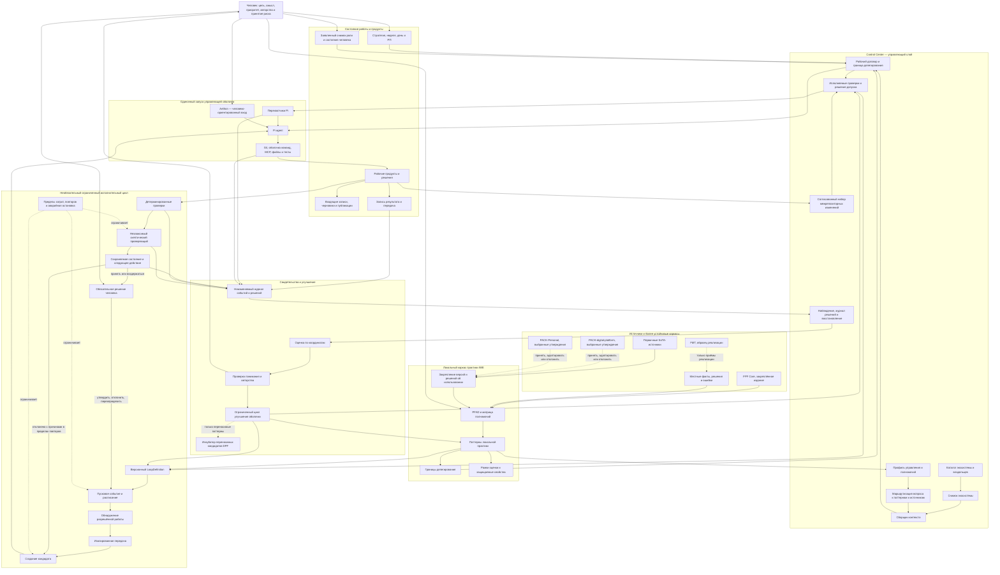

# Целевая архитектура личной IWE и управляющей оболочки агента

## Резюме решения

FMT, PACK, FPF, Control Center и управляющая оболочка агента — не конкурирующие
изделия, а объекты разных видов. Ошибкой было бы выбрать один из них и заставить его
выполнять роли всех остальных.

- **FPF** задаёт устойчивые различения и способ построения каркасов принципов.
- **PACK-digital-platform** — смешанный источник знаний о цифровых платформах,
  управлении, согласовании нескольких репозиториев и работе агентов.
- **PACK-Personal** — источник знаний о человеке как созидателе: его ролях,
  состояниях, ритме, рабочих продуктах и границах делегирования ИИ. Он не описывает
  устройство управляющей оболочки и не должен напрямую управлять её исполнением.
- **Локальный каркас практики IWE (LPF)** закрепляет правила именно этой среды,
  включая границы полномочий человека и агента.
- **Control Center** — управляющий слой рабочей системы: каталог репозиториев,
  сборка контекста, правила допуска, согласованные изменения, наблюдение и
  восстановление. Это система, а не каркас принципов.
- **Управляющая оболочка агента** обеспечивает один ограниченный запуск Pi agent:
  получает рабочий договор, контекст, инструменты и допуски, выполняет работу и
  оставляет проверяемый результат.
- **Исполнительный цикл** повторно запускает оболочку только в заранее разрешённых
  границах; он не меняет собственные полномочия, проверяющего или точку решения
  человека.

Целевая зависимость:

> **FPF Core + первичные SoTA-источники + отобранные положения PACK → локальный
> каркас практики IWE → Control Center → одиночный запуск оболочки → ограниченный
> исполнительный цикл → свидетельства → пересмотр правил и следующей версии.**

Главный архитектурный ход — перейти от растущего набора текстовых указаний к
связке «правило → исполняемая проверка или явное решение человека → свидетельство →
пересмотр». Сначала должен быть надёжен одиночный запуск. Автономное повторение без
независимой проверки, сохраняемого состояния, пределов затрат и остановки по решению
человека лишь размножает незамеченную ошибку.

PACK-Personal добавляет ещё одно обязательное ограничение: скорость и автономность
не должны покупаться ценой утраты человеком понимания, авторства или способности
принять решение без ИИ. Поэтому вид работы определяет не только способ проверки, но и
**границу делегирования**: механическое исполнение можно передавать широко, а цель,
архитектурное решение, публичный голос и принятие существенного риска остаются за
человеком.

Статус документа — **архитектурная рекомендация и заполненный кандидат PFAD**, а не
утверждённая архитектура и не реализованная исполнительная среда.

---

## 1. Что именно улучшается

Фраза «управляющая оболочка агента» скрывает несколько разных объектов. Их смешение
уже создаёт часть проблем.

| Объект | Вид | Что к нему относится | Что им не является |
|---|---|---|---|
| **Личная IWE** | работающая социотехническая система | человек, Pi agent, Aethon, Codex, репозитории, инструменты и реальные сеансы | AGENTS.md, диаграмма или набор сценариев |
| **Локальный каркас практики IWE (LPF)** | локальный каркас принципов | повторяющиеся проблемные ситуации, способы решения, границы, режимы отказа, проверки и пересмотр | FPF Core, копия PACK или дерево файлов |
| **Control Center** | управляющий слой IWE | каталог частей системы, профили управления, сборка контекста, межрепозиторные изменения, наблюдение и восстановление | LPF, очередной агент или четвёртый источник истины |
| **Управляющая оболочка агента** | исполняемая часть одного запуска | отбор контекста, перехватчики, допуски, план вызовов, инструменты, восстановление и критерий завершения | один запрос или повторяющийся цикл |
| **Оркестратор цикла** | повторяющаяся исполнительная среда над оболочкой | пусковое событие, обнаружение работы, передача, проверка, сохранение состояния, расписание и аварийные ограничители | сама оболочка, строка `cron` или бесконечные повторы |
| **Описание метода** | описание способа работы | протоколы «Открытие — Работа — Закрытие», инструкции и навыки | фактически выполненная работа |
| **План работы** | намерение выполнить работу | недельный и дневной планы, рабочий договор, условный план вызовов | вызовы инструментов и полученный результат |
| **Работа и свидетельства** | факты исполнения и основания | события инструментов, различия файлов, проверки, результат фиксации и отправки, рабочий продукт, рецензия | зелёная отметка или сообщение `pass` без основания |
| **Носители публикации и доступа** | способы показать или получить содержание | AGENTS.md, README, боковая панель Aethon, MCP и вход навыка | сами каркасы принципов, архитектура или решение допуска |
| **Снимок состояния человека** | ограниченное описание условий текущей работы | заявленная роль, доступное время, состояние внимания, граница делегирования | диагноз, постоянная характеристика личности или скрыто выведенный профиль |

Эта таблица — не терминологическое украшение. Она исправляет четыре текущие подмены:

1. текстовое правило иногда считается принуждением к исполнению;
2. запуск сценария иногда считается выполненным протоколом;
3. фиксация в Git считается закрытием работы;
4. доступ к PACK/FPF иногда считается применением их содержания;
5. наблюдение одного сеанса иногда принимается за устойчивую характеристику человека;
6. Control Center иногда ошибочно принимается за LPF, хотя один исполняет управление,
   а другой задаёт правила управления.

### Текущий объект рассмотрения (`EntityOfConcern`)

Первичный объект рассмотрения этого РП:

> **Личная IWE версии 2026-07-16 в контексте совместной и ограниченно автономной
> интеллектуальной работы человека с Pi agent и Aethon.**

Вторичный объект, который нужно создать:

> **Локальный каркас практики IWE 0.1** — набор проверяемых паттернов, определяющий
> постановку работы, сборку контекста, границу делегирования, исполнение, проверку,
> закрытие и улучшение управляющей оболочки.

Третичный объект, который связывает правила и исполнение:

> **Control Center IWE 0.1** — логический управляющий слой внутри `iwe-platform`,
> координирующий соседние репозитории и исполнительные средства. Он не требует
> создания отдельного четвёртого репозитория.

---

## 2. Как применён FPF

FPF использован не как общая инструкция модели, а через карточки практического
применения и прямые паттерны.

| Текущий вопрос | Карточка применения | Прямые паттерны | Первый полезный результат |
|---|---|---|---|
| Что за система строится и где её граница? | SYSTEM-IN-CONTEXT | A.1, C.30 | различение рабочей системы, каркаса принципов, оболочки и носителей |
| FMT, PACK, FPF или собственный вариант? | OPTION-COMPARISON | A.19.ECS, C.11 | сравнение четырёх вариантов и рекомендация |
| Как оформить собственный каркас принципов? | DPF-AUTHORING | E.4, E.4.PFAD, E.4.DPF | кандидат `PrincipleFrameworkArchitectureDecision@PersonalIWE` |
| Как провести путь от боли к структуре? | ARCHITECTURE | C.32.P2S, C.32.PAD | целевая структура оболочки и последовательность перехода |
| Что значит «улучшить»? | IMPROVEMENT | E.22, E.23 | рамка оценки, защищаемые свойства и повторная оценка |
| Как сделать допуски настоящими? | WORKING-DOCUMENTS / COSTLY-ACTION | A.21, A.10 | `GateDecision` и журнал решений вместо напоминания |
| Как планировать действия агента? | WORKING-DOCUMENTS | C.24 | рабочий договор и условный план вызовов с пределами и остановкой |
| Как не загружать весь FPF? | DESCRIPTION-USE | E.11.PUA, E.17 | маршрутизация паттернов и закреплённый манифест контекста |
| Как использовать внешний корпус знаний? | SOURCE-USE / CURRENTNESS | G.2, G.11, E.4.PFR | решение «принять — адаптировать — отклонить» с версией и условием пересмотра |
| Как не перепутать состояние человека с его устойчивой характеристикой? | SYSTEM-IN-CONTEXT / DESCRIPTION-USE | A.1, A.7, C.33, C.34 | ограниченный снимок состояния без скрытой психологической классификации |

### Важнейшие следствия из FPF

1. **FPF не является готовой операционной системой.** Он не зависит от конкретных
   инструментов и не задаёт дерево репозиториев, недельный ритм или исполнительную среду.
2. **Локальная практика не должна незаметно становиться FPF Core или DPF.** Для неё
   нужен LPF с зависимостью в сторону более устойчивых изданий.
3. **Публикационный носитель не равен каркасу принципов.** AGENTS.md, набор навыков,
   MCP и боковая панель лишь дают доступ к содержанию.
4. **Решение допуска `pass` не равно выполненной работе.** Нужны реально выполненные
   проверки, их исходы, итоговое решение и ссылки на свидетельства.
5. **Цикл улучшения оболочки начинается не со слова «цикл».** Сначала называются
   изменяемая версия оболочки и воспроизводимая оценка.
6. **Больше механизмов — не обязательно лучше.** Каждая операция должна иметь
   ожидаемый эффект, стоимость, режим отказа и условие удаления.
7. **Источник не становится полномочным только из-за названия PACK.** Утверждения
   принимаются по одному с учётом вида, зрелости, оснований и даты пересмотра.
8. **Описание человека не является самим человеком.** Оценка роли или состояния
   допустима только для объявленного применения и не даёт системе права незаметно
   расширять автономность.

### Что добавляет PACK-Personal

Проверен публичный PACK-Personal на коммите
`81f20ac7f7cbae9aedef3a6b8b3771acd5f3d0e5`. Его заявленная предметная область —
«Характеристики и состояния созидателя». Поэтому он расположен не над архитектурой
платформы, а рядом с ней: PACK-digital-platform помогает рассуждать о системе, а
PACK-Personal — о человеке, ради которого система существует.

В архитектуру принимаются следующие положения:

| Положение источника | Решение | Следствие для IWE |
|---|---|---|
| Метод ≠ инструмент; рабочий продукт ≠ описание | принять | сеанс завершается наблюдаемым продуктом, а не сообщением агента |
| Состояние ≠ устойчивая характеристика | принять | текущее состояние хранится отдельно от долговременных оценок; один сеанс не меняет профиль человека |
| «Сначала ответь сам, потом спрашивай» | адаптировать | для задач с человеческим суждением нужен исходный замысел или явная причина, почему он ещё не сформирован |
| ИИ как экзоскелет, а не замена мышления | адаптировать | агент готовит варианты и исполнение, но не присваивает цель, авторство и принятие существенного риска |
| Границы делегирования ИИ | принять как гипотезу | каждое задание получает класс делегирования и обязательную точку решения человека там, где сохраняются компетентность и авторство |
| Ритм важнее разового рывка | принять с ограничением | система защищает устойчивый ритм, но не объявляет соблюдение ритма ценностью результата |
| Ошибка как сигнал | принять | ошибка порождает запись для исправления и обучения, а не скрытый повтор или самонаказание |
| Закрыть цикл либо явно прекратить его с объяснением | принять | `Close` имеет исход `завершено`, `осознанно прекращено`, `передано` или `заблокировано`; вечного `in progress` нет |
| Накопление заметок и незакрытых циклов — режимы отказа | принять | наблюдаются возраст и поток входящих материалов, а не только их количество |
| Множитель IWE | не принимать как целевую меру | отношение плановых часов к времени за клавиатурой не измеряет качество, ценность или сохранение понимания |

Ограничение доверия существенно: положения о четырёх границах делегирования и
осознанности этих границ имеют в источнике состояние `draft`, доверие `3` и стадию
`forming`. Они полезны как проектные гипотезы и условия пилота, но не как доказанная
SoTA. Утверждения вроде «95% пользователей» и широкие выводы об ИИ не переносятся без
первичных оснований.

### Четыре класса делегирования в IWE

PACK-Personal предлагает четыре человеческие границы: сохранение компетентности,
авторство решений, публичный голос и близкие отношения. Для рабочей архитектуры они
преобразуются в проверяемую классификацию задания:

| Класс | Что можно делегировать | Что остаётся человеку | Обязательное свидетельство |
|---|---|---|---|
| **Механическое исполнение** | поиск, сверка, преобразование формата, проверка ссылок, запуск тестов | выбор полезности результата при необходимости | журнал действий и автоматические проверки |
| **Профессиональное суждение** | сбор фактов, варианты, критика, черновик | окончательное суждение и объяснение его оснований | запись принятия или отклонения человеком |
| **Архитектура и стратегия** | анализ последствий, сравнение вариантов, выявление противоречий | цель, защищаемые свойства, выбор и остаточный риск | решение с автором и условием пересмотра |
| **Публичный голос** | справки, редактура, проверка, варианты формулировок | окончательный смысл и авторская формулировка | подтверждение автором перед публикацией |
| **Личные и чувствительные отношения** | только явно запрошенная техническая помощь | содержание сообщения и ответственность за него | ручное создание или подтверждение каждого сообщения |

Эта классификация не превращается в скрытую оценку личности. Она относится к виду
конкретной работы и может быть изменена человеком в явном решении.

### Что добавляет инженерия циклов

[Статья об инженерии циклов](https://asixiv.org/pdf/curated/2606.00001)
предлагает полезное различение уровней:

```text
запрос → одна инструкция
контекст → одно окно сведений
управляющая оболочка → один оснащённый запуск
цикл → система, которая снова запускает оболочку без отдельной команды человека
```

Один проход такой системы содержит пять ходов:

> **Обнаружение → Передача → Проверка → Сохранение → Планирование следующего запуска.**

Для них нужны автоматизация, изоляция работы, навыки, соединители, разделение
создающего и проверяющего, а также сохраняемая память. Для IWE полезна не привязка
статьи к Claude Code, а сами способности: пусковое событие, обнаружение работы в
разрешённом контуре, изолированная передача, проверка, способная сказать «нет»,
состояние вне разговора и повторный запуск.

Нельзя смешивать два разных цикла:

| Цикл | Что повторяется | Частота | Кто меняет правила |
|---|---|---|---|
| **Исполнительный цикл агента** | обнаружить → выполнить → проверить → сохранить → запланировать | минуты, часы или дни | исполняет закреплённый `LoopDefinition`; сам не расширяет полномочия |
| **Цикл улучшения оболочки** | оценить точную версию → выбрать изменение → провести пилот → повторно оценить | неделя и реже | человек утверждает изменение каркаса или исполнительной среды |

Исполнительный цикл сам является объектом оценки. Он не должен переписывать
проверяющего, пределы затрат, точку решения человека или собственную границу
полномочий. Цикл улучшения может менять эти элементы только через новое версионное
архитектурное решение.

### Доказательная сила статьи

PDF обозначен как рабочая записка 2026 года и обобщает открытое руководство Orange
Book, практические сообщения и несколько полевых случаев. Это полезный источник
терминов, режимов отказа и проектных гипотез, но не контролируемое исследование.
Поэтому:

- модель повторяющихся ходов используется как **проектная модель**;
- разделение создающего и проверяющего принимается как **обязательная гипотеза пилота**;
- команды конкретных продуктов и заявления о масштабе не становятся требованиями IWE;
- эффективность подтверждается местными наблюдениями: долей отклонений, ушедшими от
  проверки дефектами, стоимостью, пониманием человека и поведением остановки.

---

## 3. Фактическое состояние IWE

### Что уже хорошо

Текущая система — не неудачная попытка. У неё есть сильный работающий фундамент:

- устойчивый ритм работы и значительная история реальных изменений;
- явное различение основания, управления и знаний;
- недельный и дневной планы, реестр РП, контекст сеанса и записи;
- сформулированная позиция «экзоскелет, не протез»;
- классы верификации и режимы автономности;
- протоколы «Открытие — Работа — Закрытие» и отдельные сценарии;
- Aethon sidebar как человеко-ориентированный entry point;
- установленный `pi-yaml-hooks`;
- восемь концептуальных допусков и первые журналы G5/G7;
- собственные записи об исполнении протоколов, FPF, FMT и архитектуре IWE;
- стратегическое решение прекратить механическое догоняние FMT уже принято в W29.

То есть не нужно перестраивать всё с нуля. Нужно поменять центр тяжести: с документов
и ритуальных сообщений на **связку «каркас принципов → исполняемое правило →
свидетельство → оценка»**.

### Базовые наблюдения аудита

| Наблюдение на 2026-07-14 | Значение |
|---|---:|
| FPF monolith | 97 255 строк, 10.2 MB, ~1.33 млн слов |
| IWE rules/protocols/scripts | ~4 600 строк без FPF |
| DayPlan-файлы в `current/` | 32 |
| DayPlan с непустой строкой `Сделано` | 21 из 32 |
| Журнал допусков | 28 записей: только G5 и G7 |
| Рабочие продукты знаний | 10 записей, 5 черновиков, 1 файл в `published/` (README) |
| `pi-yaml-hooks` | установлен, но active `hooks.yaml` не найден |
| Git с 2026-06-01 | 63 + 141 + 61 commits в трёх репозиториях |

Метрики являются диагностическими, а не оценкой качества пользователя или всей системы. Например, отсутствие строки `Сделано` не доказывает отсутствие работы, а количество commits не доказывает полезный результат.

### Готовность к циклам: запуск пока задаётся человеком

В терминах статьи IWE имеет несколько частей будущего цикла, но ещё не имеет полного
исполнительного цикла агента:

| Ход | Что уже есть | Разрыв |
|---|---|---|
| **Обнаружение** | стратегия, недельный и дневной планы, входящие, записи | выбор работы в основном делает человек; нет запускаемого по расписанию навыка с узкой областью обнаружения |
| **Передача** | допуск РП, рабочий договор, роли и приёмка | нет машиночитаемой передачи в изолированную область исполнения; `worktree` и ветка не назначаются по личности работы |
| **Проверка** | классы проверки, тесты, G5/G7 | создатель обычно проверяет себя сам; детерминированная проверка, скептический проверяющий и человеческое суждение не разделены |
| **Сохранение** | три репозитория Git, контекст сеанса, дневной план и записи | состояние записывается несколькими независимыми действиями; закрытие дня не гарантирует полную запись результата |
| **Планирование следующего запуска** | недельный ритм, командные сценарии, кнопки Aethon | ритм в основном запускает человек; нет внешнего повторяющегося события с сохранённым следующим действием |

Следовательно, IWE уже является развитой **интерактивной управляющей оболочкой**, но не
автономной средой циклов. Это хорошая исходная позиция: сейчас не нужно просто
«добавлять cron». Сначала следует закрыть критические дефекты одиночного запуска и
доказать, что проверка действительно останавливает ошибку.

### Критические дефекты

#### P0. Закрытие может зафиксировать чужое или незавершённое состояние

`close-gate.sh`, `day-close.sh` и `week-close.sh` используют `git add -A`. При наличии
незавершённых изменений закрытие превращается в безусловную фиксацию всего рабочего
дерева. Это конфликтует с безопасным исполнением в области текущей работы и делает
свидетельство Git неоднозначным.

Нужен договор области подготовленных файлов:

- какие файлы принадлежат текущей работе;
- какие ранее изменённые файлы исключены;
- какой diff проверен;
- что осталось незавершённым;
- какая фиксация действительно относится к записи результата.

#### P0. G7 может опубликовать `pass`, даже если отправка не произошла

В текущем `close-gate.sh` счётчик `pushed` увеличивается после попытки независимо от
её успеха, а итоговое решение остаётся `pass`. По FPF A.21 это не надёжное решение
допуска: нет корректного исхода каждой проверки и объединения по худшему исходу.

Минимальная семантика:

```text
GateDecision = block   если обязательный продукт, проверка или фиксация отсутствует
GateDecision = degrade если локальная фиксация есть, но удалённая синхронизация не подтверждена
GateDecision = pass    только если все обязательные проверки имеют свидетельства
```

#### P0. Закрытие дня не выполняет обещанный протокол

Сценарий ищет `current/day-YYYY-MM-DD.md`, хотя основной продукт —
`dayplan-YYYY-MM-DD.md`. Он не заполняет план и факт, не создаёт запись результата, не
обновляет контекст сеанса и не делает запись знания — в основном вызывает проверку
творческого конвейера и фиксацию с отправкой.

Кнопка Aethon при этом обещает «план/факт, запись знания, фиксация и отправка».
Публикационный носитель обещает больше, чем фактически выполняет метод.

#### P1. Установленная среда исполнения правил не используется

`pi-yaml-hooks` установлен и включён в Pi settings, но ни global, ни project `hooks.yaml` не найден. Следовательно, текущие G1–G8 остаются в основном memory-driven. Это прямо воспроизводит Н31.

#### P1. Часть допусков — напоминания, а не внешние наблюдатели

- `commit-gate.sh` говорит агенту «прочитай AGENTS.md», но не устанавливает факт чтения нужного среза протокола;
- `integration-gate.sh` печатает чеклист, но не получает и не сохраняет ответы;
- боковая панель Aethon посылает агенту просьбу выполнить сценарий, то есть инициатор и контролируемый субъект остаются одним и тем же;
- `gate_log.jsonl` содержит только G5/G7, несмотря на модель из восьми допусков.

Сценарий сам по себе не становится принуждением к исполнению. Оно появляется, когда
внешняя среда вызывает проверку до перехода, проверка возвращает машинное решение, а
действие действительно блокируется, понижается или разрешается.

#### P1. Нет единой модели полномочий утверждений

Текущая формула `DS → Pack → Base` выглядит как одна тотальная иерархия истины, но
рядом Pack назван источником истины для доменного знания, а Base — для форматов и
правил. Это разные виды утверждений, которым нужны разные владельцы.

Предлагаемая authority matrix:

| Вид утверждения | Владелец |
|---|---|
| общие conceptual distinctions | закреплённая edition FPF Core |
| доменные принципы и SoTA-способы решения | конкретное издание DPF или пакет источников с первичными основаниями |
| локальные способы работы | локальный каркас практики личной IWE |
| текущие цели и приоритеты | стратегия и недельный план |
| текущее состояние работы | дневной план, контекст РП и запись результата |
| фактически развёрнутое поведение | код, настройки и перехватчики в закреплённой фиксации |
| факт исполнения и проверки | журнал событий, различия, тесты и ссылки Git |
| человеческое решение | явная запись решения или речевой акт |

Конфликт разрешается сначала по виду утверждения, контексту и изданию, а не одной
глобальной стрелкой.

#### P1. Контекст выбирается документами, а не задачей применения

FPF размером более 10 МБ невозможно и не нужно помещать в каждый сеанс. То же
постепенно произойдёт с PACK и накопленными записями. Текущая система хорошо умеет
записывать, но слабо — выбирать, сжимать и изолировать.

Правильный ход — не сокращать FPF вручную до «главных мыслей», а сделать маршрутизатор:

1. определить текущий вопрос проекта и `EntityOfConcern`;
2. сравнить подходящие смысловые карточки практического применения;
3. открыть только выбранный прямой паттерн;
4. извлечь постановку проблемы, решение, разобранный пример, проверочный список и границу;
5. записать ссылки на издание и паттерн, а также намеренно исключённый материал в
   `ContextManifest`.

#### P1. Три репозитория создают неатомарное состояние

Все три репозитория часто меняются. Закрытие обходит их одной транзакцией лишь
концептуально, а по факту создаёт несколько независимых фиксаций и отправок. В момент
первого аудита все три имели изменения, поэтому получение удалённых изменений было
пропущено, а состояние считалось потенциально устаревшим.

Раздельные предметные границы полезны, но не обязаны совпадать с тремя репозиториями
Git. Граница репозитория оправдана, когда различаются доступ, конфиденциальность,
ответственность за сопровождение, ритм выпусков или независимое повторное
использование. Решение о слиянии должно опираться на измеренную стоимость согласования
и восстановления, а не на одну только красоту дерева.

#### P2. Косвенные показатели активности начинают заменять ценность

Система хорошо считает фиксации, записи, дневные планы и вызовы допусков. Но её
стратегическая цель — не больше файлов, а:

- лучше поставленная работа;
- меньше переделок из-за пропущенного контекста;
- восстановление сессии без потери хода мысли;
- сохранение человеческого суждения;
- проверяемые рабочие продукты;
- рост навыка мышления письмом;
- разумная стоимость ритуалов и токенов.

Нужна оценка результата, иначе оболочка будет улучшать только собственную видимость.

#### P2. Есть дрейф протоколов

Примеры:

- протоколы всё ещё утверждают, что у Pi нет перехватчиков, хотя среда установлена;
- `gates.md` описывает часть реализованных допусков как целевое состояние;
- каталог сервисов содержит S01–S12, а протокол работы местами ссылается на S01–S11;
- открытие требует повторного получения изменений при чтении, хотя изменённая рабочая
  область делает это невозможным или рискованным;
- в последней строке `day-open.sh` присутствует посторонний хвост `}]}`;
- логика закрытия недели фиксирует состояние раньше, чем агент выполняет недельный
  разбор, то есть порядок публикации расходится с обещанным методом.

Это естественный результат быстрого развития, но именно он показывает, что следующий
шаг — компиляция правил и тесты, а не ещё один слой текста.

---

## 4. Сравнение вариантов

### Вариант A — продолжать развивать ответвление FMT

Плюсы:

- много готовых практик;
- сообщество и история эксплуатации;
- полезный источник приёмов реализации.

Минусы:

- архитектура и предположения об автоматизации ориентированы прежде всего на Claude Code;
- каждое внешнее изменение требует перевода в устройство Pi/Aethon;
- локальные решения маскируются под синхронизацию с шаблоном;
- полномочия источника остаются неясными.

Вердикт: оставить как **образец реализации**, прекратить обязательную погоню за версиями.

### Вариант B — считать PACK готовым каркасом и единственным источником

Плюсы:

- ближе к доменным принципам и меньше решений, зависящих от инструмента;
- соответствует уже принятой стратегии W29;
- позволяет использовать PACK-digital-platform и PACK-Personal.

Минусы:

- оба PACK являются смешанными пакетами, а не допущенными изданиями DPF;
- PACK-Personal описывает созидателя, но не архитектуру оболочки;
- PACK-digital-platform смешивает доменные и локальные решения своей экосистемы;
- без закрепления версии и решений об использовании утверждений «опора на PACK»
  останется лозунгом;
- особенности Pi/Aethon всё равно требуют собственного локального решения.

Вердикт: использовать как проверяемые источники, а не как готовую оболочку или
единственную систему истинности.

### Вариант C — использовать FPF напрямую как ежедневный регламент

Плюсы:

- самое сильное концептуальное основание;
- явные границы утверждений, работы, допусков, свидетельств и улучшения;
- высокая переносимость между агентами и доменами.

Минусы:

- FPF намеренно не является универсальной методикой проекта;
- спецификация огромна и требует выбора паттернов;
- прямое превращение Core в операционные правила породит тяжёлую и хрупкую среду;
- локальная практика начнёт незаметно менять смысл Core.

Вердикт: использовать через маршрутизацию и локальный каркас практики, а не как
ежедневный регламент целиком.

### Вариант D — сразу создать собственный DPF платформы

Плюсы:

- появляется собственный доменный язык;
- можно объединить знания о платформе, человеке и агентах.

Минусы:

- текущий контекст относится к одной личной IWE, а не к устойчивому
  профессиональному домену;
- локальные решения почти неизбежно будут выданы за общие;
- для DPF нужны первичные SoTA-источники, конкурирующие традиции, неоднородные случаи
  применения, отношения изданий и постоянный пересмотр;
- большая стоимость авторства отвлечёт от исправления самой оболочки.

Вердикт: вести только **инкубатор кандидатов DPF**. Выделять самостоятельный DPF,
когда паттерны доказали переносимость за пределами этой IWE.

### Вариант E — LPF, выборочное использование источников и Control Center

Плюсы:

- сохраняет FPF как устойчивое основание;
- позволяет принимать положения PACK по отдельным решениям об использовании;
- локализует особенности Pi/Aethon;
- отделяет издание каркаса, носители и исполнительную среду;
- вводит проверку результата и условия удаления лишних механизмов;
- даёт одному управляющему слою согласовывать три репозитория без немедленного слияния;
- сохраняет явные границы человеческого авторства и делегирования.
- позволяет заменить FMT без потери полезных паттернов.

Минусы:

- требуется одно осознанное архитектурное решение о каркасе практики;
- нужны закреплённые версии источников, проверки и ответственный за сопровождение;
- первое время придётся поддерживать карту перехода со старой терминологией.

Вердикт: **рекомендованный вариант**.

### Архитектурный допуск

Шкала: 0–10; по оси «Сложность» высокий балл означает простоту/контролируемость реализации.

| Вариант | Э | М | О | Г | Сложность | Сопровожд. | Безопасн. | Среднее | Стоп-фактор |
|---|---:|---:|---:|---:|---:|---:|---:|---:|---|
| A. Ответвление FMT | 5 | 6 | 6 | 4 | 6 | 4 | 7 | 5.4 | главное и сопровождаемость <5 |
| B. Только PACK | 7 | 8 | 5 | 6 | 5 | 6 | 7 | 6.3 | отказоустойчивость и среднее |
| C. FPF напрямую | 6 | 8 | 5 | 6 | 3 | 5 | 7 | 5.7 | сложность <5 |
| D. Свой DPF сейчас | 6 | 7 | 6 | 5 | 3 | 3 | 7 | 5.3 | сложность и сопровождаемость <5 |
| **E. LPF + выбор источников + Control Center** | **9** | **8** | **8** | **9** | **7** | **8** | **8** | **8.1** | нет |

Эти баллы помогают принять решение, но не служат свидетельством результата. Вариант E
должен быть проверен опытной эксплуатацией и повторной оценкой после первой рабочей
недели.

Инженерия циклов не создаёт ещё один архитектурный вариант. Это способность
исполнительной среды поверх LPF, Control Center и доказанного одиночного запуска. Она
повышает порог приёмки: локальный каркас должен явно владеть границей цикла,
независимостью проверяющего, сохранением состояния, пределами затрат, расписанием и
постоянной точкой решения человека.

---

## 5. Кандидат архитектурного решения о каркасе принципов

```text
PrincipleFrameworkArchitectureDecision@PersonalIWE:
  frameworkDecisionId: PFAD-IWE-001
  governedFrameworkRef: Локальный каркас практики личной IWE (рабочее имя)
  boundedContextRef: личная интеллектуальная работа amorales с ИИ-агентами
  frameworkEditionRef: IWE-LPF-0.1-proposed
  fpfCoreEditionRef: FPF Core, 2026-07, локальный носитель
  decisionQuestion: Как должны соотноситься каркас практики, Control Center,
    управляющая оболочка и исполнительные циклы после отказа от наследования FMT?

  sourceBasisRefs:
    - FPF Core 2026-07: E.4, E.4.PFAD, E.4.DPF, E.4.PFR, G.2, G.11,
      A.1, A.10, A.15, A.21, C.24, C.33, C.34, E.22, E.23
    - PACK-digital-platform@c924cee6: выборочное использование доменных положений
    - PACK-Personal@81f20ac7: выборочное использование положений о человеке
    - первичные SoTA-источники для каждого несущего утверждения
    - факты, решения, ошибки и записи собственной IWE
    - FMT только как образец реализации
    - Loop Engineering 2026 Working Note только как проектный источник

  selectedPatternSetRefs:
    - Постановка работы
    - Граница делегирования
    - Сборка контекста
    - Вход в работу и решение допуска
    - Планирование вызовов инструментов
    - Целостность закрытия
    - Управление экосистемой репозиториев
    - Ограниченный автономный цикл и независимая проверка
    - Поток знаний и публикации
    - Оценка и улучшение управляющей оболочки

  selectedPatternRelationRefs:
    - зависит от закреплённого издания FPF Core
    - использует выбранные утверждения закреплённых версий PACK
    - использует FMT без наследования его полномочий
    - публикуется через AGENTS, карточки паттернов, навыки, перехватчики,
      Aethon и MCP

  publicationUnitRefs:
    - framework/README.md
    - framework/patterns/*.md
    - framework/decisions/PFAD-IWE-001.md

  accessCarrierRefs:
    - сокращённый AGENTS.md
    - маршрутизатор FPF и сборщик контекста
    - перехватчики Pi
    - команды Aethon
    - необязательный доступ к источникам через MCP

  dependencyAndEditionRefs:
    - зависимости направлены к закреплённым и более устойчивым изданиям
    - FPF и PACK не зависят от локальной IWE
    - репозиторий или носитель не считается самим каркасом принципов

  qualityEvaluationRefs:
    - рамка оценки управляющей оболочки 0.1
    - рамка оценки исполнительного цикла 0.1
    - еженедельная запись улучшения качества
    - проверка сохранения понимания и человеческого авторства

  rejectedAlternatives:
    - продолжать обязательную синхронизацию FMT
    - считать PACK готовой исполнительной средой или DPF по названию
    - загружать FPF целиком в каждый запрос
    - создать собственный DPF до появления переносимых доменных паттернов
    - добавлять новые правила, существующие только в памяти агента
    - сливать три репозитория до измерения причин и последствий

  consequences:
    - один LPF владеет локальными решениями практики
    - Control Center владеет управлением, но не создаёт новую всеобщую истину
    - источники и способы реализации заменяются независимо
    - допусков становится меньше, но они действительно блокируют переход
    - автономные циклы включаются только поверх проверенного одиночного запуска
    - полномочия цикла, проверяющий и точка решения человека неизменны
      внутри одного издания исполнения
    - данные о состоянии человека минимальны, объявлены им самим и не превращаются
      автоматически в устойчивые характеристики

  sourceReturnConditions:
    - прямой источник PACK обязателен до того, как утверждение начнёт управлять исполнением
    - несущему утверждению PACK требуется первичное основание или явный статус гипотезы
    - возврат к FPF нужен, если локальная формулировка меняет вид утверждения
      или границу паттерна

  refreshOrSupersessionConditions:
    - изменение FPF или PACK затрагивает принятое утверждение
    - меняется модель событий Pi/Aethon
    - доля ложных блокировок или пропусков превышает установленный предел
    - среднее трение сеанса превышает допустимый бюджет
    - трижды повторяется одно локальное неправильное применение
    - человек не может объяснить случайную выборку принятых результатов
    - схема репозиториев перестаёт обеспечивать нужные доступы или целостность изменений
```

### Первые паттерны локального каркаса практики

Не нужно сразу переписывать все протоколы. Первое издание должно иметь несколько
полных паттернов, меняющих действие, а не каталог тем. `BOUNDED-LOOP` включается
только при появлении автономно повторяющегося профиля исполнения.

| Паттерн | Повторяющаяся проблемная ситуация | Положительный ход решения | Блокируемый режим отказа |
|---|---|---|---|
| **LPF.WORK-FRAME** | просьба звучит как разговор, но нужен рабочий результат | восстановить потребителя, вид результата, приёмку, автономность и остановку | гладкий ответ вместо работы |
| **LPF.DELEGATION-BOUNDARY** | удобство подталкивает передать агенту человеческое суждение | классифицировать работу и закрепить то, что остаётся за человеком | утрата авторства, понимания или компетентности |
| **LPF.CONTEXT-ASSEMBLY** | доступно больше контекста, чем полезно текущей работе | собрать закреплённый `ContextManifest` под конкретное применение | выгрузка всего контекста и устаревшие утверждения |
| **LPF.WORK-ENTRY** | агент готов действовать, но готовность не доказана | внешний допуск запуска с действенными проверками и журналом решения | напоминание вместо блокирующего механизма |
| **LPF.CLOSE-INTEGRITY** | результат есть в разговоре, но не восстановим и не проверяем | `ResultRecord`, рабочий продукт, свидетельства, передача и ограниченная фиксация | фиксация вместо закрытия и ложный `pass` |
| **LPF.ECOSYSTEM-CONTROL** | изменение затрагивает несколько репозиториев и источников | снимок экосистемы, согласованный набор изменений и проверка целостности | частичное изменение и межрепозиторный дрейф |
| **LPF.BOUNDED-LOOP** | надёжный одиночный запуск хочется повторять без команды человека | версионный `LoopDefinition`, изоляция, независимая проверка, сохраняемое состояние, пределы и решение человека | слепой, соглашательский, забывающий или бесконечный цикл |
| **LPF.KNOWLEDGE-FLOW** | записи накапливаются, но не меняют практику | решение об использовании источника → паттерн, черновик, публикация или явный архив | складирование записей без переработки |
| **LPF.HARNESS-IMPROVEMENT** | хочется добавить правило, перехватчик или инструмент | назвать версию объекта, ожидаемый эффект, стоимость и условие удаления | бесконтрольный рост семейства операций |

---

## 6. Целевая архитектура



### 6.1 Источники, версии и границы полномочий

Создать машиночитаемое закрепление версий, например `framework/sources.lock.yaml`:

```yaml
fpf:
  edition: "2026-07"
  carrier: "FPF/FPF-Spec.md"
  sha256: "<computed>"

sources:
  - id: pack-digital-platform
    edition: "c924cee6fb01247cbed5b411d1387194b007b4f0"
    access: "git"
    authority: "selected_claims_only"
    role: "domain_source_package"
  - id: pack-personal
    edition: "81f20ac7f7cbae9aedef3a6b8b3771acd5f3d0e5"
    access: "git"
    authority: "selected_claims_only"
    role: "human_factors_source_package"

references:
  - id: fmt
    edition: "<commit>"
    authority: "implementation_reference_only"
  - id: loop-engineering-working-note
    edition: "asixiv-curated-2606.00001"
    carrier: "https://asixiv.org/pdf/curated/2606.00001"
    authority: "design_input_only"
```

Никакой источник не получает полномочий только потому, что доступен через MCP, имеет
слово `PACK` в названии или хорошо пересказан в записи. Для каждого несущего
положения нужна строка в реестре использования:

```yaml
claim_id: "local-delegation-boundary-001"
local_use: "выбор обязательного решения человека"
source_ref: "PACK-Personal@81f20ac7/PD.FORM.110"
source_status: "draft; trust=3; epistemic_stage=forming"
decision: "adapt_as_pilot_hypothesis"
adopted_payload: "сохранять компетентность и авторскую ответственность"
rejected_or_bounded_payload: "четыре класса не считаются исчерпывающей SoTA-таксономией"
primary_evidence_ref: "missing"
owner: "IWE-LPF"
refresh_when: "появились первичные исследования или три случая неверной классификации"
```

Порядок полномочий определяется видом утверждения:

| Вид утверждения | Владелец |
|---|---|
| фундаментальное различение | закреплённое издание FPF Core |
| переносимый доменный способ решения | допущенный DPF и первичные SoTA-источники |
| локальная норма работы | LPF личной IWE |
| цель и приоритет | стратегия и явное решение человека |
| фактическое устройство | код, настройки и проверенный снимок системы |
| факт исполнения | журнал событий, различия файлов, тесты и ссылки Git |
| состояние человека в текущем сеансе | его явное сообщение, действующее только в объявленном сроке |

#### Условие выделения собственного DPF

Сейчас переносимые идеи хранятся как кандидаты рядом с LPF, но не получают
полномочий DPF. Выделение самостоятельного доменного каркаса «инженерия личных
ИИ-рабочих сред» допустимо только одновременно при следующих условиях:

1. есть не менее трёх существенно разных рабочих сред или команд, а не три варианта
   одной личной IWE;
2. накоплено не менее 10–15 полных паттернов с проблемной ситуацией, положительным
   способом решения, границей, режимом отказа и разобранным случаем;
3. первичные SoTA-источники и конкурирующие школы действительно меняют выбор
   паттернов, а не украшают список литературы;
4. показаны случаи переноса и случаи, где паттерн не работает;
5. отдельные паттерны прошли оценку E.21, а пакет — E.4.DPF.DA с порогом не ниже `4`
   для заявленного применения;
6. назначен ответственный за издания, зависимости, пересмотр и устаревание.

До этого момента «свой DPF» остаётся инкубатором, а локальные правила принадлежат LPF.

### 6.2 Control Center как управляющий слой, а не новый источник истины

Control Center следует развивать логически внутри `iwe-platform`. Отдельный четвёртый
репозиторий сейчас не нужен: он увеличит число переходов, но не добавит новой границы
доступа или независимого жизненного цикла.

Минимальные рабочие продукты управляющего слоя:

| Рабочий продукт | Содержание | Владелец истины |
|---|---|---|
| **Каталог экосистемы** (`EcosystemCatalog`) | репозитории, их роли, владельцы, доступы, команды проверки и источники фактического состояния | `iwe-platform` хранит каталог; каждый репозиторий подтверждает собственные сведения |
| **Профиль управления** (`ControlProfile`) | разрешённые чтение, изменение, отправка, публикация, виды обязательного решения человека | LPF и локальные правила безопасности |
| **Снимок экосистемы** (`EcosystemSnapshot`) | ветка, HEAD, расхождение с удалённым хранилищем, изменённые пути, доступность зависимостей | фактическое состояние Git и инструментов |
| **Согласованный набор изменений** (`CrossRepoChangeSet`) | цель, затрагиваемые репозитории, порядок, проверки, промежуточные состояния, откат и итог | конкретная работа и её журнал решений |
| **Запись результата** (`ResultRecord`) | продукты, приёмка, свидетельства, незавершённые части и дальнейшее действие | завершённый запуск оболочки |
| **Журнал событий и происшествий** | решения допусков, ошибки, восстановление и последствия | исполнительная среда; LPF использует журнал только как основание пересмотра |

Control Center не копирует содержимое соседних репозиториев и не объявляет себя
главным источником всех утверждений. Он знает, **где находится владелец каждого вида
утверждений**, собирает нужный срез и обеспечивает согласованный переход.

Один межрепозиторный переход выполняется так:

1. собрать снимок всех затрагиваемых репозиториев;
2. определить владельца каждого изменяемого утверждения и границы доступа;
3. создать `CrossRepoChangeSet` с порядком изменений и критериями целостности;
4. выполнить изменения по репозиториям без сокрытия частичного успеха;
5. проверить каждую часть и сквозное свойство результата;
6. либо завершить весь набор, либо записать частичное состояние и точный путь
   восстановления;
7. передать человеку решение, если изменены стратегия, архитектура, публикация,
   доступ или существенный риск.

Это не атомарная транзакция базы данных: несколько репозиториев невозможно
зафиксировать одним коммитом. Надёжность создаётся явным набором изменений,
идемпотентными шагами, проверкой промежуточных состояний и восстановлением, а не
словом «атомарно».

Нужны как минимум три профиля управления:

- **инженерный** — код, настройки, тесты, развёртывание и технические документы;
- **стратегический** — чтение целей и планов, подготовка вариантов без автономного
  изменения стратегии;
- **знаниевый** — разбор входящих записей, подготовка черновиков и проверка связей без
  самостоятельной публикации от имени человека.

Профиль определяет доступы и точки человеческого решения; модель агента не может
расширить их своим выводом.

### 6.3 Сборщик контекста

Каждый нетривиальный сеанс получает небольшой `ContextManifest`:

```yaml
task_ref: WP-43
entity_of_concern: Personal-IWE-Work-System@2026-07-16
receiving_use: architecture_improvement

selected:
  - source: FPF-2026-07
    patterns: [E.4, E.4.PFAD, E.4.DPF, E.4.PFR, G.2, G.11, A.21, C.24, E.22, E.23]
  - source: PACK-Personal@81f20ac7
    claims: [PD.D.001, PD.D.005, PD.FORM.110, PD.PRINC.032, PD.PRINC.036, PD.PRINC.037]
    use_decision: "только выбранные положения; FORM.110 — гипотеза пилота"
  - source: WeekPlan-W29
    sections: [PACK-to-IWE]
  - source: local-captures
    ids: [protocol-enforcement, m2-iwe-architecture]

omitted:
  - "семейства паттернов FPF, не относящиеся к текущему применению"
  - "положения PACK-Personal о программах развития и измерении личности"
  - "операционные документы шлюза безопасности"

freshness:
  workspace_snapshot: "<snapshot-id>"
  potentially_stale: true
```

Это одновременно ограничивает разрастание контекста, делает актуальность видимой и
позволяет воспроизвести основания решения.

Инженерия циклов усиливает правило реализации: всё, что можно надёжно определить
обычной программой — репозиторий, ветку, версии источников, изменённые пути, пределы
затрат, списки разрешений, команды тестов и уже открытые кандидаты — собирает
**детерминированный оркестратор до запуска агента**. Языковая модель получает готовые
материалы и решает только семантически неоднозначную часть. Нельзя поручать агенту
«самому найти весь нужный контекст», а затем тем же агентом подтверждать полноту поиска.

### 6.4 Рабочий договор

Существующий допуск РП стоит упростить до компактного договора:

```yaml
work: "какое преобразование выполняется"
consumer: "кто использует результат и для чего"
result_kind: "какой точный рабочий продукт появляется"
human_role: "какое суждение и авторство остаётся человеку"
agent_role: "какую работу выполняет агент"
acceptance: "дешёвая проверка или рассмотрение человеком"
autonomy: "trivial|closed-loop|open-loop|problem-framing"
delegation_class: "mechanical|professional_judgement|architecture_strategy|public_voice|personal_sensitive"
human_context:
  basis: "self_reported"
  active_role: "профессионал"
  attention_or_state: "необязательно; только для текущего сеанса"
  expires_at: "конец сеанса"
budget: "предел времени, инструментов и риска"
stop_or_return: "когда остановиться, передать человеку или сменить паттерн"
```

Не все поля нужно каждый раз показывать человеку. Оболочка восстанавливает их из
плана и контекста и запрашивает только недостающее, которое меняет способ работы.
Поле `human_context` не заполняется скрытым выводом модели. Отсутствие сведений о
состоянии означает «неизвестно», а не «состояние нормальное».

### 6.5 План вызовов только там, где он нужен

Для простых и большинства замкнуто проверяемых задач достаточно рабочего договора.
`CallPlan` появляется, когда есть несколько путей исполнения, внешнее побочное
действие, существенный бюджет или риск перепланирования:

```yaml
objective: "produce_patch_and_verify"
routes_in_order: [inspect, patch, targeted_tests]
budget:
  time: "45m"
  risk: "только обратимые изменения в рабочей области"
stop_or_replan: "тесты дважды не прошли или область изменений расширилась"
next_action: "enact_now"
```

Это реализует C.24 без бюрократии для каждой команды.

### 6.6 Минимальный набор исполнительных допусков

Вместо восьми равноправных напоминаний предлагаются четыре сильных допуска перехода.
Остальные проверки становятся частями этих допусков или предупреждениями.

| Допуск | Пусковое событие | Действенные проверки | Возможные решения |
|---|---|---|---|
| **SessionEntryGate** | `session.created` / первая содержательная работа | снимок области и экосистемы, состояние дня, рабочий договор, манифест контекста, автономность и делегирование | pass/degrade/block |
| **MutationGate** | до изменения файлов или команды с побочным действием | разрешённая область, ранее изменённые файлы, правило риска, резервная копия или пробный запуск | pass/block |
| **CommitGate** | до фиксации Git | область подготовленных файлов, обязательная проверка, черновик записи результата, отсутствие посторонних файлов | pass/degrade/block |
| **CloseGate** | явное закрытие или готовность завершить сеанс | продукт, свидетельства приёмки, обновление плана и передачи, решение о знаниях, фиксация и удалённая синхронизация | pass/degrade/block |

Существующие проверки распределяются так:

- ритм, день, РП и чтение протокола → `SessionEntryGate`;
- получение изменений и актуальность → проверка снимка рабочей области;
- интеграция и архитектура → условные проверки, включаемые видом работы;
- фиксация и закрытие → отдельные допуски границ работы.

Каждый допуск должен публиковать:

```json
{
  "gate_id": "CloseGate",
  "profile": "core",
  "checks": [
    {"kind":"artifact_exists","outcome":"pass","evidence":"..."},
    {"kind":"remote_sync","outcome":"degrade","evidence":"push failed"}
  ],
  "decision": "degrade",
  "snapshot":"...",
  "timestamp":"..."
}
```

Правило худшего исхода: `block > degrade > pass > abstain`.

### 6.7 Снимок рабочей области вместо повторного Pull-on-Read

Текущий Pull-on-Read создаёт сетевой и когнитивный шум, а изменённая рабочая область
делает его непредсказуемым.

Предлагаемый `WorkspaceSnapshot` один раз на SessionEntry:

```text
репозиторий, ветка, HEAD, расхождение с удалённым хранилищем,
изменённые пути, результат синхронизации, время снимка
```

Правило:

- чистая область → разрешены pull/rebase и закрепление нового HEAD;
- изменённая область → pull не выполняется автоматически; снимок получает
  `potentially_stale`;
- дальнейшая работа использует закреплённый снимок;
- обновление выполняется только по явному событию: изменился источник, сменился
  контекст или сеанс длится дольше установленного срока.

Так актуальность становится наблюдаемым свойством, а не повторяющимся ритуалом.

### 6.8 Aethon

Aethon остаётся удобным человеко-ориентированным носителем доступа, но кнопка в
боковой панели не должна считаться принуждением к исполнению.

Целевая роль Aethon:

- показать состояние снимка рабочей области и допусков;
- запустить ту же детерминированную точку входа, которую используют перехватчики;
- показать действующий рабочий договор, пределы и следующее действие;
- отобразить запись результата и свидетельства;
- дать человеку утвердить, отклонить или обоснованно переопределить решение там,
  где требуется открытая проверка.

Если API Aethon не умеет безопасно исполнять команду напрямую, вызов через запрос
модели можно оставить как сокращение интерфейса, но явно помечать его как **просьбу**,
а не как выполненный протокол.

### 6.9 LoopDefinition — договор автономного повторения

Расписание не должно содержать скрытую стену инструкций. Оно ссылается на версионный
навык и отдельный машиночитаемый договор:

```yaml
loop_id: iwe-maintenance-proposal
edition: 0.1-proposed
owner: amorales
purpose: "найти и подготовить одно проверяемое исправление технического обслуживания IWE"
control_profile: engineering-maintenance@0.1
delegation_class: mechanical

trigger:
  kind: schedule
  cadence: weekly

discovery:
  skill_ref: iwe-maintenance-triage@0.1
  sources: [gate_log, smoke_tests, protocol_drift, broken_links]
  max_candidates: 3
  selection_rule: "наибольшая подтверждённая серьёзность в пределах полномочий"

authority:
  may_read: [platform, strategy_current]
  may_mutate: [isolated_platform_worktree]
  never: [merge, push, delete, change_strategy, rewrite_loop_definition]

handoff:
  result_kind: patch_candidate
  isolation: one_worktree_per_candidate
  max_active_candidates: 1
  change_set_ref: changes/<run-id>/change-set.yaml

verification:
  deterministic: [targeted_tests, diff_scope, markdown_links]
  evaluator_ref: iwe-skeptical-reviewer@0.1
  evaluator_context: fresh
  human_checkpoint: required_before_merge
  cross_repository_integrity: required_when_multiple_repositories

persistence:
  state_ref: loop-state/iwe-maintenance-proposal.yaml
  candidate_ref: inbox/loop-candidates/<run-id>.md

budgets:
  wall_time: 30m
  generator_evaluator_cycles: 2
  parallel_agents: 1
  daily_token_cap: "<set-after-baseline>"

stop:
  on: [budget_exhausted, ambiguous_authority, repeated_reject, dirty_scope_expansion]
  action: persist_and_wait_for_human
```

Обязательный инвариант: один проход цикла может обновить только `LoopState` и
разрешённый рабочий продукт-кандидат. Он не может менять правила обнаружения работы,
проверяющего, пределы затрат, правила остановки или точку решения человека. Эти
изменения принадлежат циклу улучшения оболочки и требуют нового издания.

### 6.10 Проверка: детерминированные проверки, независимый проверяющий и человек

Статья справедливо усиливает исходную идею внешнего наблюдателя. Для IWE одного «второго агента» недостаточно; нужны три основания решения:

| Слой | Для чего | Что не следует ему поручать |
|---|---|---|
| **Детерминированные проверки** | синтаксис, тесты, пути, область различий, пределы затрат и инварианты правил | смысловое суждение и архитектурный выбор |
| **Независимый проверяющий** | скептическая проверка результата против рабочего договора и приёмки; проверка действием через инструменты | исправлять и одновременно удостоверять собственную правку |
| **Решение человека** | цель, компромиссы, архитектурное или стратегическое суждение, принятие остаточного риска и сохранение авторства | повторять все механические проверки вручную |

Проверяющий получает кандидат и критерии приёмки, но не внутреннее самообоснование
создавшего его агента. Желательны другой профиль модели и свежий контекст. Его решение:

```yaml
candidate_ref: "..."
checks_observed: ["..."]
verdict: accept | reject | abstain
reasons: ["..."]
evidence_refs: ["test://...", "diff://..."]
confidence: low | medium | high
next_action: human_review | regenerate | stop
```

Правила:

1. `accept` невозможен без свидетельств для всех обязательных проверок;
2. `abstain` не превращается в `pass` — кандидат передаётся человеку;
3. если проверяющий изменил кандидат, он стал создателем; новую версию проверяет
   свежий проверяющий;
4. доля отклонений сама по себе не доказывает качество: проверяющий сверяется с
   небольшой выборкой, размеченной человеком;
5. ни модель, ни проверяющий не могут обойти жёсткий допуск или увеличить бюджет;
6. для классов «профессиональное суждение», «архитектура и стратегия» и «публичный
   голос» требуется не только проверка качества, но и явное подтверждение понимания
   человеком.

### 6.11 Первый цикл IWE: предложение технического обслуживания, не стратегический автопилот

Первым автономным циклом не должны быть дневное планирование, стратегическая сессия,
синтез заметок или публикация знаний: там высока доля человеческого суждения, а ошибка
быстро становится частью будущего контекста.

Рекомендуемый пилот — **еженедельный цикл предложений по техническому обслуживанию IWE**:

1. **Обнаружение:** найти до трёх наблюдаемых проблем — неуспешный допуск,
   сломанный проверочный тест или ссылка, расхождение протокола и сценария, ложный `pass`.
2. **Передача:** выбрать одну проблему с дешёвой приёмкой и открыть отдельный `git worktree`.
3. **Создание:** подготовить одну ограниченную правку-кандидат.
4. **Проверка:** выполнить детерминированные тесты; свежий проверяющий пытается
   опровергнуть исправление и проверяет область различий.
5. **Сохранение:** записать состояние, свидетельства и кандидат во входящие;
   отклонённый кандидат также сохраняется как свидетельство.
6. **Планирование:** следующий запуск начинается с предыдущего состояния и не
   дублирует уже открытый кандидат.
7. **Решение человека:** человек выбирает `merge / reject / reframe`; автоматические
   слияние и отправка запрещены.

Пилот начинается с одного агента и одного кандидата. Параллельность добавляется
последней — только после того, как проверяющий несколько раз нашёл реальные дефекты,
остановка сработала корректно, а порог понимания не нарушен.

### 6.12 Репозитории и границы размещения

Не следует заранее выбирать между тремя репозиториями и единым репозиторием. По FPF
граница репозитория — граница носителя и управления изменениями, а не автоматически
граница предметной области или каркаса принципов.

Ближайшая целевая схема сохраняет три репозитория:

```text
~/iwe-platform/       # LPF, Control Center, правила, сценарии, перехватчики и тесты
~/ds-strategy/        # цели, планы, решения и состояние РП
~/ds-knowledge-index/ # входящие, записи, черновики и публикации
```

Control Center ведёт их каталог, общий снимок и `CrossRepoChangeSet`. Внешние
FPF/PACK/FMT остаются отдельными закреплёнными зависимостями.

Слияние рассматривается позже только при наличии одного из оснований:

- одинаковые доступы и правила конфиденциальности;
- одинаковый жизненный цикл выпуска;
- частые изменения действительно требуют совместной фиксации;
- измеренная стоимость частичных межрепозиторных изменений выше стоимости слияния;
- перенос не разрушает независимое повторное использование знаний или управления.

До появления этих оснований федеративная схема с Control Center лучше сохраняет
границы и оставляет обратимый путь. Если основания появятся, проводится отдельное
архитектурное решение с резервной копией и сохранением истории Git.

---

## 7. Оценка: что значит «лучше»

### Рамка вопроса о качестве

```text
ObjectVersionUnderQualityEvaluation:
  Управляющая оболочка личной IWE @ baseline-2026-07-16
  необязательный исполнительный цикл @ точное издание пилота

Purpose:
  floorEvaluation + candidateImprovementProposalEvaluation

ImprovementAim:
  повысить надёжность постановки, отбора контекста, исполнения правил,
  восстановления и качества принятой работы при меньшем ритуальном трении;
  для профиля цикла — сократить время жизни ошибки без потери человеческого суждения

ProtectedTradeoffs:
  человеческое суждение, авторство, автономность, простота, приватность,
  переносимость, практика мышления письмом, время и стоимость токенов

QualificationWindow:
  одна рабочая неделя или минимум 10 содержательных сеансов

NonUseBoundary:
  не оценивать компетентность человека по числу фиксаций или записей;
  не считать вызов перехватчика, активность агента или число созданных файлов
  доказательством результата;
  не выводить устойчивые характеристики человека из одного сеанса
```

### Координаты и пороги

Не сводить всё к одному числу. Использовать пороги и явно показывать компромиссы.

| Координата | Как наблюдать | Порог 0.1 |
|---|---|---|
| **Соответствие работы** | приёмка подтверждает именно заявленный вид результата | ≥90% содержательных сеансов без подмены работы гладким текстом |
| **Точность контекста** | выбранные источники имеют конкретное применение; лишнее явно исключено | 100% открыто проверяемых и постановочных сеансов с `ContextManifest` |
| **Покрытие исполнением правил** | обязательный переход имеет внешнее решение допуска | 100% переходов изменения, фиксации и закрытия |
| **Правдивость решения** | `pass` подкреплён исходами проверок и свидетельствами | 0 ложных `pass` |
| **Восстановление** | новый сеанс восстанавливает действующую работу и следующее действие | ≤5 минут до осмысленного продолжения |
| **Целостность закрытия** | продукт, приёмка, передача и ограниченное состояние Git | ≥90% полных закрытий; остальные `degrade/block`, без ложного успеха |
| **Сохранение человеческого суждения** | открытые решения имеют явный выбор человека | 100% архитектурных и стратегических решений |
| **Соответствие границе делегирования** | класс делегирования совпадает с фактическими полномочиями агента | 100% задач с человеческим суждением имеют явную точку решения человека |
| **Сохранение понимания** | человек объясняет цель, устройство и риск случайной выборки принятых результатов | ≥80%; непонятый результат не принимается как собственное решение |
| **Чистота описания состояния** | состояние человека имеет явное основание, срок и не превращается в постоянную характеристику | 0 скрытых выводов; 100% записей состояния имеют срок действия |
| **Трение** | накладные расходы открытия и закрытия, ложные блокировки | медиана открытия ≤3 мин, закрытия ≤5 мин; ложные блокировки <10% |
| **Стоимость контекста** | выбранные токены и байты, повторная загрузка | снижение без потери соответствия работы |
| **Проходимость знаний** | запись меняет паттерн, решение, черновик или публикацию либо архивируется | ни одной бессрочной записи без решения о дальнейшей судьбе |
| **Вынесенное мышление** | проверяемый текст, ADR, запись или публикация | ≥1 содержательный продукт в неделю |
| **Переносимость** | локальный каркас не содержит особенностей поставщика в основных паттернах | привязки Pi/Aethon вынесены в профиль исполнения |
| **Целостность нескольких репозиториев** | работа имеет снимок, набор изменений и явный итог каждой части | 0 скрытых частичных успехов; 100% частичных состояний имеют путь восстановления |
| **Восстановимость управления** | новый сеанс Control Center восстанавливает открытый набор изменений | ≤5 минут; без повторного изменения завершённой части |

### Дополнительные координаты автономного цикла

Цикл нельзя оценивать теми же косвенными показателями активности, что и одиночный
запуск. Его главный риск — ошибка, пережившая несколько проходов и записавшая себя в
память как факт.

| Координата | Как наблюдать | Порог пилота |
|---|---|---|
| **Точность обнаружения** | доля кандидатов, которые человек признал реальной и уместной работой | ≥70% после первых 10 запусков; до этого собираются данные калибровки |
| **Покрытие независимой проверкой** | кандидат проверен свежим проверяющим, а не создателем | 100% кандидатов |
| **Полезность проверяющего** | найден подтверждённый дефект либо дан обоснованный `accept/abstain` | каждое решение со свидетельствами; 0 безусловных похвал |
| **Расстояние жизни ошибки** | число переходов от неуспешного свидетельства до остановки или отклонения | 0 переходов после обязательного отказа |
| **Долг проверки** | принятые кандидаты без независимой проверки и решения человека | 0 |
| **Непрерывность состояния** | следующий запуск читает состояние, не дублирует кандидата и объясняет следующее действие | 100% возобновлений |
| **Ограниченность затрат** | превышение времени, токенов, повторов и параллельности | 0 превышений; предел действительно останавливает запуск |
| **Управляемость** | аварийная остановка, `abstain` и ожидание человека проходят стендовый тест | 100% до первого запуска без наблюдения |
| **Сохранение понимания** | человек объясняет назначение, устройство и риск случайной выборки принятых изменений | ≥80%; непонятое изменение не принимается |
| **Граница суждения** | стратегия, архитектура, публикация и слияние требуют решения человека | 100% |

После 10 содержательных кандидатов отсутствие хотя бы одного `reject` или `abstain`
не доказывает дефект проверяющего автоматически, но обязательно запускает калибровку:
нужно проверить слишком лёгкую работу, утечку контекста создателя и критерии решения.

### Реестр четырёх долгов цикла

Статья выделяет четыре взаимно усиливающихся долга. В IWE они распространяются не
только на код, но и на планы, записи, архитектурные утверждения и публикации.

| Долг | Ранний сигнал | Ограничитель в IWE |
|---|---|---|
| **Долг проверки** | результаты растут быстрее свидетельств; проверяющий почти всегда согласен | независимый проверяющий, жёсткие проверки и запрет автоматических слияния и публикации |
| **Разложение понимания** | владелец не может объяснить случайный принятый продукт | еженедельный смысловой разбор выборки; непонятное не считается принятым |
| **Отказ от собственного суждения** | человек выбирает предложенный циклом результат без собственной позиции | постоянное решение человека для стратегии, архитектуры и публикации; явные `reject/reframe` |
| **Раздувание токенов** | повторы и дополнительные агенты растут без новых свидетельств | пределы запуска и периода, число циклов и параллельности, аварийная остановка |

### Цикл улучшения управляющей оболочки

Раз в неделю:

1. выбрать точную версию оболочки;
2. выполнить оценку по тем же координатам;
3. выбрать не более 1–2 изменений с ожидаемым эффектом;
4. назвать стоимость, риск и защищаемые свойства;
5. внедрить на ограниченном срезе;
6. повторно оценить на следующей неделе;
7. `stop`, `continue`, `switch`, `openNewFrame` или `hold`;
8. удалить операцию, если ожидаемого эффекта нет.

Это защищает от бесконечного добавления перехватчиков, метрик, карт и текстов протоколов.

---

## 8. Последовательность внедрения

### Фаза 0 — правдивость до перестройки (1–2 ч)

Цель: перестать публиковать ложную надёжность.

- [ ] убрать посторонний хвост из `day-open.sh`;
- [ ] исправить путь DayPlan в Day Close;
- [ ] запретить `git add -A` без набора файлов текущей работы;
- [ ] сделать ошибку отправки → `degrade`, а не `pass`;
- [ ] отделить ранее изменённые файлы от изменений текущей работы;
- [ ] добавить быстрые проверочные тесты открытия, закрытия и допусков во временных
  репозиториях;
- [ ] не менять архитектуру каркаса в этой фазе.

Приёмка:

> Ни одно закрытие не фиксирует посторонние пути и не публикует `pass` без свидетельств.

### Фаза 1 — LPF и использование источников 0.1 (4–6 ч)

- [ ] утвердить/скорректировать PFAD-IWE-001;
- [ ] создать матрицу полномочий;
- [ ] создать `sources.lock.yaml`;
- [ ] создать реестр использования утверждений PACK с решениями «принять —
  адаптировать — отклонить»;
- [ ] оформить первые полные паттерны: WORK-FRAME, DELEGATION-BOUNDARY,
  CONTEXT-ASSEMBLY, CLOSE-INTEGRITY и ECOSYSTEM-CONTROL;
- [ ] оставить BOUNDED-LOOP неактивным до пилота одиночного запуска;
- [ ] отметить `SPF`, `TPF` и «PACK как единая истина» как прежние или условные названия;
- [ ] создать исходную рамку оценки;
- [ ] не переписывать все старые протоколы до оценки.

Приёмка:

> Для типичного сеанса можно определить паттерн, точный результат, класс
> делегирования, границу полномочий и способ исполнения без чтения всего корпуса.

### Фаза 2 — минимальный Control Center (4–6 ч)

- [ ] создать каталог трёх репозиториев с ролями, владельцами и командами проверки;
- [ ] определить инженерный, стратегический и знаниевый профили управления;
- [ ] реализовать общий `EcosystemSnapshot`;
- [ ] определить `CrossRepoChangeSet` и три исхода: завершён, частично завершён,
  восстановлен;
- [ ] добавить проверку, что фактическое состояние каждого репозитория совпадает со
  снимком перед изменением;
- [ ] проверить искусственный частичный отказ и восстановление.

Приёмка:

> Межрепозиторное изменение не может завершиться «успехом», если одна из частей не
> проверена; частичное состояние всегда имеет владельца и дальнейшее действие.

### Фаза 3 — пилот исполняемой оболочки (5–8 ч)

- [ ] добавить проектный `.pi/hook/hooks.yaml`;
- [ ] реализовать SessionEntryGate, MutationGate, CommitGate, CloseGate;
- [ ] каждая проверка возвращает структурированный исход и ссылки на свидетельства;
- [ ] добавить WorkspaceSnapshot;
- [ ] создать сборщик `ContextManifest` и извлечение нужного паттерна FPF;
- [ ] направить боковую панель Aethon на те же точки входа;
- [ ] вести дописываемый журнал событий отдельно от решений управления;
- [ ] разделить детерминированные проверки, создателя и свежего проверяющего хотя бы
  на одном виде работы;
- [ ] тестом доказать `reject`, `abstain`, остановку по бюджету и ожидание человека;
- [ ] провести минимум 10 пилотных сеансов.

Приёмка:

> До первого изменения загружен релевантный срез протокола или паттерна, а его
> отсутствие блокирует или понижает надёжность перехода согласно профилю.

### Фаза 4 — первый ограниченный исполнительный цикл (4–6 ч + 10 запусков)

- [ ] утвердить `LoopDefinition@iwe-maintenance-proposal-0.1`;
- [ ] расписание вызывает версионный навык обнаружения, а не встроенную стену запроса;
- [ ] использовать один кандидат и один изолированный `git worktree` на запуск;
- [ ] добавить сохраняемый `LoopState` и подавление повторов;
- [ ] установить пределы времени, токенов, повторов и параллельности до первого
  запуска без наблюдения;
- [ ] запретить автоматические слияние, отправку, изменение стратегии и самоизменение;
- [ ] провести 10 запусков, начиная с ручного пуска; расписание включить только после
  успешных тестов остановки;
- [ ] человек классифицирует кандидаты и решения проверяющего для калибровки.

Приёмка:

> Цикл проходит обнаружение, передачу, создание, проверку, сохранение и планирование,
> умеет остановиться по четырём разным причинам, не переносит обязательный отказ в
> следующий запуск и оставляет человеку решение о слиянии или переопределении.

### Фаза 5 — упрощение и регулярное улучшение (4–8 ч, затем еженедельно)

- [ ] удалить или сжать дублирующие правила после того, как их реально обеспечивает
  исполнительная среда;
- [ ] оставить AGENTS.md сокращённым входным носителем: пусковые события,
  маршрутизация полномочий и жёсткие границы;
- [ ] переписать протоколы как паттерны LPF либо описания исполнительных методов — не
  смешивать эти виды;
- [ ] архивировать механизм синхронизации FMT и оставить карту происхождения решений;
- [ ] каждую неделю оценивать точные издания оболочки и `LoopDefinition`;
- [ ] выбирать не более двух улучшений, фиксировать ухудшившиеся свойства и удалять
  неэффективные проверки;
- [ ] читать и объяснять случайную смысловую выборку принятых результатов;
- [ ] вести реестр долгов проверки, понимания и стоимости токенов;
- [ ] возвращаться к PFAD только при изменении семейства каркаса, набора паттернов,
  архитектуры публикации и доступа или границы зависимости.

Приёмка:

> Каждое обязательное правило имеет одного владельца, одну связь с исполнением либо
> явную границу человеческого суждения и один путь к свидетельствам.

---

## 9. Реалистичный срез для W29 (~4 ч)

Полная перестройка не помещается в текущий бюджет WP-43 и нарушила бы принцип
соразмерности затрат FPF. Лучший минимальный срез:

| Время | Работа | Результат |
|---:|---|---|
| 0.5 ч | закрепить версии FPF и двух PACK, создать первые строки реестра использования | видимые основания и ограничения источников |
| 0.5 ч | принять PFAD, матрицу полномочий и границу делегирования | один кандидат архитектурного решения |
| 0.75 ч | создать минимальный каталог экосистемы и формат `CrossRepoChangeSet` | основа Control Center без нового репозитория |
| 1.0 ч | исправить правдивость закрытия и ограниченную фиксацию | безопасный минимальный порог закрытия |
| 0.75 ч | включить два пилотных перехватчика: вход в сеанс и готовность закрытия | внешние наблюдатели для Н31 и Close |
| 0.5 ч | быстрый тест частичного отказа и передача результата | свидетельства и воспроизводимое восстановление |

Не брать в W29:

- полную миграцию трёх репозиториев;
- переписывание всех протоколов;
- создание собственного DPF;
- все восемь допусков;
- автономный повторяющийся цикл без наблюдения;
- параллельных агентов и автоматическое слияние;
- панель показателей и сложные метрики;
- RAG или векторный указатель FPF до появления измеренной потребности в поиске.

---

## 10. Что прекратить делать

1. **Не догонять FMT по версиям.** Смотреть его только при конкретном вопросе реализации.
2. **Не загружать FPF целиком.** Использовать путь «вопрос → карточка → прямой паттерн
   → точный результат».
3. **Не называть напечатанный список допуском.** Допуск существует только при
   реальном переходе и машинно или человечески принятом решении.
4. **Не считать фиксацию и отправку закрытием.** Закрытие включает запись результата,
   приёмку, передачу, решение о знаниях и свидетельства Git.
5. **Не создавать PACK или DPF ради названия.** Сначала нужны граница предметной
   области, повторяющиеся проблемы, источники, способы решения и переносимые случаи.
6. **Не добавлять перехватчик без ожидаемого эффекта и условия удаления.**
7. **Не использовать одну всемирную иерархию истины для разных видов утверждений.**
8. **Не оценивать IWE числом файлов, фиксаций и записей.** Это наблюдения активности,
   а не ценность.
9. **Не смешивать перенос, исправление и перестройку каркаса в одной работе.**
10. **Не автоматизировать человеческое суждение.** Архитектурный и стратегический
    выбор остаётся явной ролью человека.
11. **Не ставить расписание над ненадёжным одиночным запуском.** Повторение увеличивает
    область последствий текущих дефектов.
12. **Не позволять создателю удостоверять собственный результат.** Самопроверка
    полезна как подготовка, но не как окончательное решение.
13. **Не считать решение человека временной подпоркой.** Для стратегии, архитектуры,
    публикации и слияния это постоянная граница ответственности.
14. **Не выводить устойчивые характеристики человека из журналов активности.**
    Состояние сеанса и характеристика личности — разные виды утверждений.
15. **Не считать Control Center четвёртым источником истины.** Он маршрутизирует
    полномочия и согласует переходы, а не владеет всем содержанием.

---

## 11. Риски рекомендации

| Риск | Как ограничить |
|---|---|
| LPF станет ещё одной папкой с текстами | начать с паттернов, каждый сразу связать с перехватчиком, тестом или явным решением человека |
| терминология FPF перегрузит повседневную работу | внутренние ссылки держать в каркасе, а в интерфейсе использовать обычный русский язык |
| перехватчики начнут мешать | профили «лёгкий» и «основной», измерение ложных блокировок, обоснованное переопределение и условие удаления |
| PACK будет использован по пересказам | до прямой проверки и закрепления версии помечать утверждение как непроверенное |
| черновые положения PACK-Personal станут обязательной психологической моделью | применять только к виду работы, не к личности; хранить статус источника и условие пересмотра |
| Control Center станет монолитным хозяином всех данных | каталог указывает владельцев, но не копирует и не присваивает их утверждения |
| межрепозиторный переход останется частично выполненным | `CrossRepoChangeSet`, промежуточные состояния, повторяемые шаги и проверенный путь восстановления |
| оценка станет самоцелью | пороги вместо одного числа; не более двух изменений в неделю; защищать простоту и человеческое суждение |
| сильный агент обойдёт слабые правила | критические границы исполняет внешняя среда; объяснение агента не заменяет решение допуска |
| независимый проверяющий станет ритуальным «вторым мнением» | свежий контекст, проверки действием, `abstain` и сверка с выборкой человека |
| цикл ускорит долг проверки и понимания | один кандидат, постоянное решение человека, смысловая выборка и реестр долгов |
| расписание будет повторять неверное основание | неизменяемый в одном издании `LoopDefinition`, сохранённые свидетельства, нулевой перенос обязательного отказа и аварийная остановка |

---

## 12. Использование источников и ограничения аудита

### Прямо использованные локальные источники

- [`FPF/FPF-Spec.md`](FPF/FPF-Spec.md), издание 2026-07: карточки практического
  применения, E.4, E.4.PFAD, E.4.DPF, E.4.DPF.DA, E.4.PFR, G.2, G.11, A.1,
  A.10, A.21, C.24, C.33, C.34, E.22 и E.23;
- [`AGENTS.md`](AGENTS.md);
- [`memory/protocols/gates.md`](memory/protocols/gates.md);
- [`memory/protocols/open.md`](memory/protocols/open.md);
- [`memory/protocols/work.md`](memory/protocols/work.md);
- [`memory/protocols/close.md`](memory/protocols/close.md);
- [`scripts/day-open.sh`](scripts/day-open.sh);
- [`scripts/day-close.sh`](scripts/day-close.sh);
- [`scripts/gates/close-gate.sh`](scripts/gates/close-gate.sh);
- [`scripts/gates/commit-gate.sh`](scripts/gates/commit-gate.sh);
- [публичный репозиторий FMT](https://github.com/TserenTserenov/FMT-exocortex-template)
  только как образец реализации.

### Прямо проверенные внешние источники

- [PACK-Personal@81f20ac7](https://github.com/aisystant/PACK-personal/tree/81f20ac7f7cbae9aedef3a6b8b3771acd5f3d0e5):
  предметная граница, различения метода, инструмента, рабочего продукта, состояния и
  характеристики; методы работы с ИИ; черновая модель границ делегирования;
  принципы собственного ответа, ритма, рабочего продукта, ошибки и закрытия цикла;
  режимы отказа накопления заметок и незакрытых обязательств.
- [PACK-digital-platform@c924cee6](https://github.com/TserenTserenov/PACK-digital-platform/tree/c924cee6fb01247cbed5b411d1387194b007b4f0):
  различения управления и исполнения, контроллера и оркестратора, распределённой и
  монолитной оркестрации, программной фабрики и платформы, межрепозиторного дрейфа.
- [HuaShu, *Loop Engineering: The Anthropic Playbook for Designing Systems That Prompt Your Agents — A Field Study of Designing Loops That Run Themselves*](https://asixiv.org/pdf/curated/2606.00001),
  рабочая записка 2026 года, 11 страниц. Использованы уровни «запрос — контекст —
  оболочка — цикл», повторяющиеся ходы, разделение создающего и проверяющего,
  режимы отказа, модель долгов и ограничения первого цикла.

### Источники из DS

- `/Users/amorales/ds-strategy/current/weekplan-2026-W29.md`;
- `/Users/amorales/ds-strategy/current/wp-38-fpf-personal-iwe-synthesis.md`;
- `/Users/amorales/ds-strategy/docs/Strategy.md`;
- `/Users/amorales/ds-strategy/docs/Dissatisfactions.md`;
- `/Users/amorales/ds-strategy/docs/WP-REGISTRY.md`;
- `/Users/amorales/ds-knowledge-index/captures/2026-07-09-m2-iwe-architecture.md`;
- `/Users/amorales/ds-knowledge-index/captures/2026-07-05-protocol-enforcement.md`;
- `/Users/amorales/ds-knowledge-index/captures/2026-07-03-gates-architecture-pi-yaml-hooks.md`.

### Ограничения

1. Исходные численные наблюдения раздела 3 относятся к аудиту 2026-07-14 и не
   считаются текущим состоянием без повторного измерения.
2. Анализ FPF относится к приложенному `FPF-Spec.md` в состоянии репозитория
   `iwe-platform` на 2026-07-16.
3. Оба PACK проверены напрямую и закреплены коммитами, но это не превращает их в
   допущенные DPF. Они используются как смешанные пакеты источников.
4. В PACK-Personal только 12 файлов в разделе SoTA при нескольких сотнях материалов;
   многие положения имеют внутренние источники, а положения о границах делегирования
   ИИ пока являются черновыми. Для несущих решений нужны первичные основания или
   явный статус гипотезы.
5. PACK-Personal заявляет узкую предметную границу, но фактически содержит также
   материалы об IWE, агентах, образовательных программах и локальной методике. Это
   полезный корпус, но требует проверки границы каждого заимствования.
6. Рекомендация основана на статическом аудите и истории рабочих продуктов. Нужны
   пилотные наблюдения и повторная оценка, прежде чем объявлять оболочку улучшенной.
7. Статья об инженерии циклов является вторичным практическим обобщением, а не
   контролируемым исследованием или нормативной спецификацией. Её модели приняты как
   проверяемые проектные гипотезы.

---

## 13. Итог

Личная IWE уже переросла ответвление FMT, но пока не полностью оформила собственную
архитектурную идентичность. Поэтому система колеблется между наследованием FMT,
ссылками на PACK и добавлением локальных правил. FPF показывает более точный выход:

> **Создать собственный LPF, использовать PACK только по отдельным решениям,
> закрепить первичные источники, отделить Control Center от исполнительной оболочки,
> превратить критические границы в перехватчики или явные решения человека, доказать
> надёжность одиночного запуска и лишь затем включать ограниченные исполнительные циклы.**

PACK-Personal не меняет устройство платформы напрямую. Он меняет критерий хорошей
архитектуры: система должна не только ускорять выпуск продуктов, но и сохранять
понимание, авторство и способность человека принимать решения. Control Center не
является LPF; он исполняет правила LPF и связывает три репозитория.

Первый приоритет — не новый PACK, не собственный DPF и не расписание. Первый
приоритет — **правдивое закрытие, изменения только в области текущей работы,
снимок экосистемы, минимальный Control Center, два внешних допуска и независимая
граница проверки**. Первый автономный пилот после этого занимается только
предложениями по техническому обслуживанию IWE: один кандидат, один `git worktree`,
жёсткие пределы, свежий проверяющий и обязательное решение человека.
