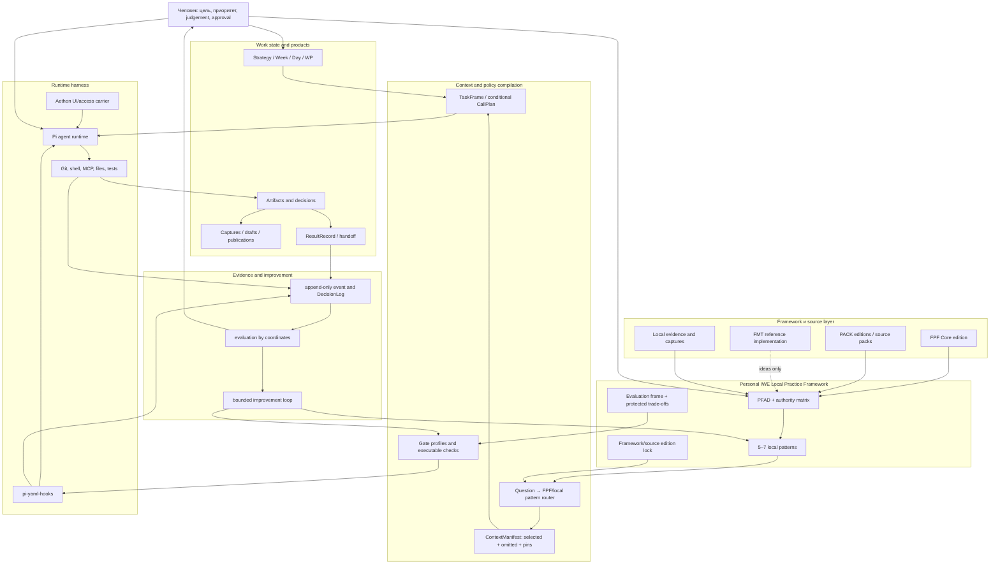

# IWE после FMT: целевая архитектура Personal Agent Harness на основании FPF

## Резюме решения

Рекомендую не выбирать между FMT, PACK и FPF как между взаимоисключающими продуктами.
Это объекты разных видов и уровней:

- **FPF** — устойчивое концептуальное основание и язык паттернов для постановки, проверки и улучшения интеллектуальной работы;
- **PACK-digital-platform / PACK-personal** — доменные framework-источники, из которых следует осознанно заимствовать принципы и паттерны;
- **FMT** — одна реализация IWE под другой toolchain; полезна как reference implementation, но не как upstream, который нужно догонять;
- **ваша IWE** — локальная рабочая система и одновременно собственный **Local Practice Framework** для пары «человек + агент»;
- **harness** — исполняемая часть этой системы: контекстная сборка, gates, hooks, инструменты, журнал фактов и recovery.

Целевая формула:

> **FPF Core → доменные PACK-источники → Personal IWE Local Practice Framework → исполняемый harness Pi/Aethon → evidence → улучшение следующей версии.**

Главный архитектурный ход: перестать наращивать инструкции и начать компилировать выбранные правила в исполняемые, наблюдаемые и проверяемые механизмы. При этом не превращать всю работу в gates и формы: FPF прямо требует добавлять harness-операции только тогда, когда ожидаемое улучшение оправдывает стоимость и трение.

Статус этого документа — **рекомендация и заполненный кандидат PFAD**, а не утверждённая архитектура и не реализованный runtime.

---

## 1. Что именно улучшается

Фраза «harness-среда» скрывает несколько разных объектов. Их смешение уже создаёт часть проблем.

| Объект | Вид | Что к нему относится | Что им не является |
|---|---|---|---|
| **Personal IWE Work System** | работающая социотехническая система | пользователь, Pi agent, Aethon, Codex, репозитории, инструменты, реальные сессии | AGENTS.md, диаграмма или набор скриптов |
| **Personal IWE Local Practice Framework** | episteme / локальный principle framework | повторяющиеся problem situations, solution moves, границы, failure modes, проверки, refresh | FPF Core, копия PACK или дерево файлов |
| **Agent harness** | исполняемая часть рабочей системы | context selection, hooks, gates, call planning, budgets, telemetry, recovery | один prompt или один loop |
| **Method descriptions** | описания способов работы | протоколы Open/Work/Close, инструкции, skills | фактически выполненная работа |
| **Work plans** | намерение выполнить работу | WeekPlan, DayPlan, TaskFrame, CallPlan | выполненные tool calls и полученный результат |
| **Work и evidence** | факты исполнения и основания | tool events, diff, tests, commit/push result, artifact, review | зелёный badge или сообщение «pass» без evidence |
| **Publication/access carriers** | способы доступа | AGENTS.md, README, Aethon sidebar, MCP, skill entry | сами framework, архитектура или gate decision |

Эта таблица — не терминологическое украшение. Она исправляет четыре текущие подмены:

1. текстовое правило иногда считается enforcement;
2. запуск скрипта иногда считается выполненным протоколом;
3. commit считается закрытием работы;
4. доступ к PACK/FPF иногда считается применением их содержания.

### Текущий EntityOfConcern

Первичный EntityOfConcern этого WP:

> **Personal IWE Work System версии 2026-07-14 в контексте личной интеллектуальной работы с Pi agent + Aethon.**

Вторичный объект, который нужно создать:

> **Personal IWE Local Practice Framework v0.1** — локальный framework, определяющий повторяемые способы постановки работы, сборки контекста, исполнения, проверки, закрытия и улучшения harness.

---

## 2. Как применён FPF

FPF использован не как общий prompt, а через конкретные practical-use cards и прямые паттерны.

| Текущий вопрос | Practical-use card | Прямые паттерны | Первый полезный результат |
|---|---|---|---|
| Что за система строится и где её граница? | SYSTEM-IN-CONTEXT | A.1, C.30 | явное различение Work System, framework, harness и carriers |
| FMT, PACK, FPF или собственный вариант? | OPTION-COMPARISON | A.19.ECS, C.11 | сравнение четырёх вариантов и рекомендация |
| Как оформить собственный framework? | DPF-AUTHORING | E.4, E.4.PFAD, E.4.DPF | кандидат `PrincipleFrameworkArchitectureDecision@PersonalIWE` |
| Как провести путь от боли к структуре? | ARCHITECTURE | C.32.P2S, C.32.PAD | целевая структура harness и migration slices |
| Что значит «улучшить»? | IMPROVEMENT | E.22, E.23 | evaluation frame, protected trade-offs и loop с re-evaluation |
| Как сделать gates настоящими? | WORKING-DOCUMENTS / COSTLY-ACTION | A.21, A.10 | GateDecision + DecisionLog, а не напоминание или зелёный текст |
| Как планировать действия агента? | WORKING-DOCUMENTS | C.24 | TaskFrame и условный CallPlan с budget/stop/replan |
| Как не загружать весь FPF? | DESCRIPTION-USE | E.11.PUA, E.17 | pattern router и source-pinned ContextManifest |

### Важнейшие следствия из FPF

1. **FPF не является готовой операционной системой.** Он tool-agnostic и не задаёт структуру репозиториев, meeting cadence или runtime.
2. **Локальная практика не должна незаметно становиться FPF Core.** Для неё нужен Local Practice Framework с зависимостью в сторону более устойчивых framework editions.
3. **Публикационный carrier не равен framework.** AGENTS.md, skill pack, MCP и sidebar только дают доступ.
4. **Gate pass не равен выполненной работе.** Нужны effective checks, их outcomes, агрегированное решение и evidence refs.
5. **Harness loop начинается не со слова loop.** Сначала называются изменяемая версия harness и повторяемая evaluation.
6. **Больше harness — не обязательно лучше.** Каждая операция должна иметь ожидаемое изменение evaluation, стоимость, failure mode и removal condition.

---

## 3. Фактическое состояние IWE

### Что уже хорошо

Текущая система — не неудачная попытка. У неё есть сильный работающий фундамент:

- устойчивый ритм работы и значительная история реальных изменений;
- явное различение Base / governance / knowledge;
- WeekPlan, DayPlan, WP Registry, session context и captures;
- сформулированная позиция «экзоскелет, не протез»;
- классы верификации и режимы автономности;
- протоколы Open / Work / Close и отдельные scripts;
- Aethon sidebar как человеко-ориентированный entry point;
- установленный `pi-yaml-hooks`;
- 8 концептуальных gates и первые журналы G5/G7;
- собственные captures о protocol enforcement, FPF, FMT и архитектуре IWE;
- стратегическое решение прекратить механическое догоняние FMT уже принято в W29.

То есть не нужно «перестраивать всё с нуля». Нужно поменять центр тяжести: с документов и ритуальных сообщений на **связку framework → executable policy → evidence → evaluation**.

### Базовые наблюдения аудита

| Наблюдение на 2026-07-14 | Значение |
|---|---:|
| FPF monolith | 97 255 строк, 10.2 MB, ~1.33 млн слов |
| IWE rules/protocols/scripts | ~4 600 строк без FPF |
| DayPlan-файлы в `current/` | 32 |
| DayPlan с непустой строкой `Сделано` | 21 из 32 |
| Gate log | 28 записей: только G5 и G7 |
| Knowledge artifacts | 10 captures, 5 drafts, 1 файл в `published/` (README) |
| `pi-yaml-hooks` | установлен, но active `hooks.yaml` не найден |
| Git с 2026-06-01 | 63 + 141 + 61 commits в трёх репозиториях |

Метрики являются диагностическими, а не оценкой качества пользователя или всей системы. Например, отсутствие строки `Сделано` не доказывает отсутствие работы, а количество commits не доказывает полезный результат.

### Критические дефекты

#### P0. Close может закоммитить чужое или незавершённое состояние

`close-gate.sh`, `day-close.sh` и `week-close.sh` используют `git add -A`. При наличии незавершённых пользовательских изменений Close превращается в безусловный commit всего рабочего дерева. Это конфликтует с безопасным task-scoped execution и делает commit evidence неоднозначным.

Нужен staged-scope contract:

- какие файлы принадлежат текущей работе;
- какие pre-existing dirty-файлы исключены;
- какой diff проверен;
- что осталось незавершённым;
- какой commit действительно относится к ResultRecord.

#### P0. G7 может опубликовать `pass`, даже если push не произошёл

В текущем `close-gate.sh` счётчик `pushed` увеличивается после попытки независимо от её успеха, а итоговое решение остаётся `pass`. По FPF A.21 это не GateDecision, на который можно полагаться: нет корректного outcome каждого check и worst-wins aggregation.

Минимальная семантика:

```text
GateDecision = block   если обязательный artifact/check/commit отсутствует
GateDecision = degrade если локальный commit есть, но remote sync не подтверждён
GateDecision = pass    только если все обязательные checks имеют evidence
```

#### P0. Day Close не выполняет обещанный Day Close

Скрипт ищет `current/day-YYYY-MM-DD.md`, хотя основной артефакт — `dayplan-YYYY-MM-DD.md`. Он не заполняет план/факт, не создаёт ResultRecord, не обновляет session context и не делает capture — в основном вызывает проверку creative pipeline и commit/push.

Кнопка Aethon при этом обещает «план/факт, capture, commit + push». Публикационный carrier обещает больше, чем фактически выполняет method implementation.

#### P1. Установленный enforcement runtime не используется

`pi-yaml-hooks` установлен и включён в Pi settings, но ни global, ни project `hooks.yaml` не найден. Следовательно, текущие G1–G8 остаются в основном memory-driven. Это прямо воспроизводит Н31.

#### P1. Часть «гейтов» — напоминания, а не внешние наблюдатели

- `commit-gate.sh` говорит агенту «прочитай AGENTS.md», но не устанавливает факт чтения релевантного protocol slice;
- `integration-gate.sh` печатает чеклист, но не получает и не сохраняет ответы;
- Aethon sidebar посылает prompt агенту «выполни скрипт», то есть инициатор и контролируемый субъект остаются одним и тем же;
- `gate_log.jsonl` содержит только G5/G7, несмотря на модель из восьми gates.

Скрипт сам по себе не становится enforcement. Enforcement появляется, когда внешний runtime вызывает проверку до перехода, проверка возвращает машинное решение, а действие реально block/degrade/pass в зависимости от результата.

#### P1. Нет единой модели авторитетности claims

Текущая формула `DS → Pack → Base` выглядит как одна тотальная иерархия истины, но рядом Pack назван source-of-truth для доменного знания, а Base — source-of-truth для форматов и правил. Это разные claim kinds, которым нужны разные owners.

Предлагаемая authority matrix:

| Claim kind | Владелец |
|---|---|
| общие conceptual distinctions | закреплённая edition FPF Core |
| domain principles и SoTA moves | конкретная edition PACK / source pack |
| локальные способы работы | Personal IWE Local Practice Framework |
| текущие цели и приоритеты | Strategy / WeekPlan |
| текущее состояние работы | DayPlan / WP context / ResultRecord |
| фактически развернутое поведение | code/config/hooks в закреплённом commit |
| факт исполнения и проверки | event log, diff, tests, commit/push refs |
| человеческое решение | явный decision record / speech act |

Конфликт разрешается сначала по виду claim, контексту и edition, а не одной глобальной стрелкой.

#### P1. Контекст выбирается документами, а не receiving use

FPF размером более 10 MB невозможно и не нужно помещать в каждую сессию. То же постепенно произойдёт с PACK и накопленными captures. Текущая система умеет `Write`, но слабо реализует `Select`, `Compress` и `Isolate`.

Правильный ход — не сокращать FPF вручную до «главных мыслей», а сделать router:

1. определить текущий project question и EntityOfConcern;
2. сравнить подходящие semantic practical-use cards;
3. открыть только выбранный direct pattern;
4. извлечь Problem frame, Solution, worked slice, checklist и boundary;
5. записать edition/pattern refs и deliberately omitted material в ContextManifest.

#### P1. Три репозитория создают неатомарное состояние

Все три репозитория часто меняются, Close обходит их одной транзакцией лишь концептуально, а по факту создаёт несколько независимых commits/push. В момент аудита все три были dirty, поэтому pull был пропущен и состояние пришлось считать potentially stale.

Раздельные bounded contexts полезны; три Git-репозитория для них не обязательны. Git boundary оправдана, когда различаются access, confidentiality, stewardship, release cadence или независимое повторное использование. Сейчас эти различия не выражены достаточно сильно, чтобы компенсировать transaction и recovery cost.

#### P2. Activity proxies начинают заменять value

Система хорошо считает commits, captures, DayPlans и gate invocations. Но её стратегическая цель — не больше файлов, а:

- лучше поставленная работа;
- меньше rework из-за пропущенного контекста;
- восстановление сессии без потери хода мысли;
- сохранение человеческого judgement;
- проверяемые рабочие продукты;
- рост навыка мышления письмом;
- разумная стоимость ритуалов и токенов.

Нужна outcome evaluation, иначе harness будет улучшать собственную видимость.

#### P2. Есть protocol drift

Примеры:

- протоколы всё ещё утверждают, что у Pi нет hooks, хотя runtime установлен;
- `gates.md` описывает часть реализованных gates как целевое состояние;
- service catalog содержит S01–S12, а Work protocol местами ссылается на S01–S11;
- Open требует повторных pull-on-read, тогда как dirty workspace делает это либо невозможным, либо рискованным;
- в последней строке `day-open.sh` присутствует посторонний хвост `}]}`;
- логика Week Close коммитит состояние раньше, чем агент выполняет Week Review, то есть publication порядка расходится с обещанным методом.

Это естественный результат быстрого развития, но именно он показывает, что следующий шаг — compilation/tests, а не ещё один слой prose.

---

## 4. Сравнение вариантов

### Вариант A — продолжать развивать fork FMT

Плюсы:

- много готовых практик;
- сообщество и история эксплуатации;
- полезный источник implementation patterns.

Минусы:

- архитектура и automation assumptions ориентированы прежде всего на Claude Code/FMT runtime;
- каждое upstream-изменение требует перевода «FMT → Pi/Aethon»;
- локальные решения регулярно маскируются под синхронизацию с template;
- source authority остаётся неясной.

Вердикт: оставить как **reference implementation**, прекратить version-chasing как обязательный процесс.

### Вариант B — PACK-only

Плюсы:

- ближе к domain principles и меньше tool-specific решений;
- соответствует уже принятой стратегии W29;
- позволяет использовать PACK-digital-platform и PACK-personal по их назначению.

Минусы:

- PACK всё ещё не является вашей локальной системой или конкретным runtime;
- без source pins и source-use decisions «опора на PACK» останется лозунгом;
- закрытый `PACK-personal` сейчас не был доступен для прямой проверки;
- локальные trade-offs Pi/Aethon всё равно требуют собственного framework decision.

Вердикт: использовать как source frameworks, не как готовый harness.

### Вариант C — FPF напрямую как operating manual

Плюсы:

- самое сильное концептуальное основание;
- явные границы claims, work, gates, evidence и improvement;
- высокая переносимость между агентами и доменами.

Минусы:

- FPF намеренно не является универсальной project methodology;
- спецификация огромна и требует pattern selection;
- прямое превращение Core в операционные правила породит тяжёлый и хрупкий runtime;
- локальная практика начнёт незаметно менять смысл Core.

Вердикт: использовать через router и локальный framework, не как ежедневный регламент целиком.

### Вариант D — собственный Local Practice Framework поверх FPF и PACK

Плюсы:

- сохраняет FPF как устойчивое основание;
- позволяет принимать PACK по exact source-use decisions;
- локализует Pi/Aethon implementation choices;
- отделяет framework edition от carriers и runtime;
- вводит evaluation и removal conditions;
- позволяет заменить FMT без потери полезных паттернов.

Минусы:

- требуется один осознанный framework architecture decision;
- нужны source pins, tests и stewardship;
- первое время придётся поддерживать migration map со старой терминологией.

Вердикт: **рекомендованный вариант**.

### Arch Gate

Шкала: 0–10; по оси «Сложность» высокий балл означает простоту/контролируемость реализации.

| Вариант | Э | М | О | Г | Сложность | Сопровожд. | Безопасн. | Среднее | Стоп-фактор |
|---|---:|---:|---:|---:|---:|---:|---:|---:|---|
| A. FMT fork | 5 | 6 | 6 | 4 | 6 | 4 | 7 | 5.4 | главное и сопровождаемость <5 |
| B. PACK-only | 7 | 8 | 6 | 7 | 5 | 7 | 7 | 6.7 | среднее <7 |
| C. FPF direct | 6 | 8 | 5 | 6 | 3 | 5 | 7 | 5.7 | сложность <5 |
| **D. Local Practice Framework** | **9** | **8** | **8** | **9** | **7** | **8** | **8** | **8.1** | нет |

Эти баллы — decision aid, а не evidence результата. Вариант D должен быть проверен пилотом и re-evaluation после первой рабочей недели.

---

## 5. Кандидат Principle Framework Architecture Decision

```text
PrincipleFrameworkArchitectureDecision@PersonalIWE:
  frameworkDecisionId: PFAD-IWE-001
  governedFrameworkRef: Personal IWE Local Practice Framework (provisional name)
  boundedContextRef: личная интеллектуальная работа amorales с AI agents
  frameworkEditionRef: IWE-LPF-0.1-proposed
  fpfCoreEditionRef: FPF Core, July 2026, local modified carrier
  decisionQuestion: Какой framework и runtime должны управлять Personal IWE после отказа от FMT-upstream?

  sourceBasisRefs:
    - FPF Core practical-use cards и direct patterns
    - PACK-digital-platform (нужна прямая edition/source проверка)
    - PACK-personal (пока только вторичные локальные captures)
    - факты и captures собственной IWE
    - FMT только как reference implementation

  selectedPatternSetRefs:
    - Work Framing
    - Context Assembly
    - Work Entry and Gate Decision
    - Agentic Tool-Use Planning
    - Work Continuity and Close Integrity
    - Knowledge/Publication Flow
    - Harness Evaluation and Improvement

  selectedPatternRelationRefs:
    - dependsOn FPF Core edition
    - sourceReuse from selected PACK editions
    - implementationReference to FMT editions without authority inheritance
    - publication/access through AGENTS, pattern cards, skills, hooks, Aethon and MCP

  publicationUnitRefs:
    - framework/README.md
    - framework/patterns/*.md
    - framework/decisions/PFAD-IWE-001.md

  accessCarrierRefs:
    - slim AGENTS.md
    - fpf-router / context compiler
    - Pi hooks
    - Aethon UI commands
    - optional MCP source access

  dependencyAndEditionRefs:
    - dependencies point toward pinned, more stable framework editions
    - no reverse dependency from FPF or PACK into local IWE

  qualityEvaluationRefs:
    - Harness Evaluation Frame v0.1
    - weekly QualityImprovementLoopRecord

  rejectedAlternatives:
    - continue mandatory FMT synchronization
    - treat PACK as a ready runtime
    - load FPF into every prompt
    - add more memory-only rules

  consequences:
    - one local framework becomes the owner of practice decisions
    - source and implementation choices become independently replaceable
    - initial migration and test cost
    - fewer but stronger gates

  sourceReturnConditions:
    - direct PACK source becomes mandatory before a PACK claim governs runtime
    - return to FPF when local wording changes claim kind or pattern boundary

  refreshOrSupersessionConditions:
    - FPF/PACK edition change affects an adopted claim
    - Pi/Aethon event model changes
    - gate false-block or miss rate exceeds floor
    - median session friction exceeds budget
    - local misuse repeats three times
```

### Предлагаемые первые patterns Local Practice Framework

Не нужно сразу переписывать все протоколы. Первая edition должна иметь 5–7 нормальных action-guiding patterns, а не каталог тем.

| Pattern seed | Recurring problem situation | Positive solution move | Failure mode, который блокирует |
|---|---|---|---|
| **LPF.WORK-FRAME** | запрос звучит как текстовая просьба, но нужен рабочий результат | восстановить consumer, result kind, acceptance, autonomy и stop | гладкий ответ вместо работы |
| **LPF.CONTEXT-ASSEMBLY** | доступно больше контекста, чем полезно текущей работе | собрать source-pinned ContextManifest под receiving use | full-context dumping и stale claims |
| **LPF.WORK-ENTRY** | агент готов действовать, но readiness/gates не доказаны | внешний LaunchGate с effective checks и DecisionLog | напоминание вместо enforcement |
| **LPF.TOOL-PLAN** | non-trivial tool use может тратить бюджет или мутировать state | CallPlan с route, budget, stop/replan; для простой работы не применять | opaque tool chain и blind retry |
| **LPF.CLOSE-INTEGRITY** | результат есть в чате, но не восстановим и не проверяем | ResultRecord + artifact + evidence + handoff + scoped commit | commit-as-close и ложный pass |
| **LPF.KNOWLEDGE-FLOW** | captures накапливаются, но не меняют практику и не публикуются | source-use decision → pattern/draft/publication или explicit archive | capture hoarding |
| **LPF.HARNESS-IMPROVEMENT** | хочется добавить ещё rule/hook/tool | назвать object version, evaluation change, cost, trade-offs и removal condition | operation-family creep |

---

## 6. Целевая архитектура



### 6.1 Framework/source layer

Создать machine-readable lock, например `framework/sources.lock.yaml`:

```yaml
fpf:
  edition: "2026-07"
  carrier: "FPF/FPF-Spec.md"
  sha256: "<computed>"

sources:
  - id: pack-digital-platform
    edition: "<commit-or-edition>"
    access: "mcp|git|cache"
    status: "unverified_until_direct_access"
  - id: pack-personal
    edition: "<commit-or-edition>"
    access: "mcp|git|cache"
    status: "unavailable"

references:
  - id: fmt
    edition: "<commit>"
    authority: "implementation_reference_only"
```

Никакой source не становится authority только потому, что доступен через MCP или хорошо пересказан в capture.

### 6.2 Context compiler

Каждая non-trivial сессия получает маленький `ContextManifest`:

```yaml
task_ref: WP-43
entity_of_concern: Personal-IWE-Work-System@2026-07-14
receiving_use: architecture_recommendation

selected:
  - source: FPF-2026-07
    patterns: [E.4, E.4.PFAD, E.4.DPF, A.21, C.24, E.22, E.23]
  - source: WeekPlan-W29
    sections: [PACK-to-IWE]
  - source: local-captures
    ids: [protocol-enforcement, m2-iwe-architecture]

omitted:
  - "unrelated FPF pattern families"
  - "security-gateway operational docs"

freshness:
  workspace_snapshot: "<snapshot-id>"
  potentially_stale: true
```

Это одновременно решает context bloat, currentness и replay.

### 6.3 TaskFrame

Существующий WP Gate стоит упростить до compact contract:

```yaml
work: "какое преобразование выполняется"
consumer: "кто использует результат и для чего"
result_kind: "какой точный рабочий продукт появляется"
human_role: "какое judgement остаётся человеку"
agent_role: "какую работу выполняет система в agential role"
acceptance: "дешёвая проверка или human review"
autonomy: "trivial|closed-loop|open-loop|problem-framing"
budget: "time/tool/risk ceiling"
stop_or_return: "когда остановиться, спросить или сменить pattern"
```

Не все поля нужно каждый раз показывать пользователю. Harness восстанавливает их из плана и контекста и спрашивает только недостающее, которое реально меняет работу.

### 6.4 CallPlan только там, где он нужен

Для trivial и большинства closed-loop задач достаточно TaskFrame. `CallPlan` появляется, когда есть несколько routes, внешний side effect, существенный budget или replan risk:

```yaml
objective: "produce_patch_and_verify"
routes_in_order: [inspect, patch, targeted_tests]
budget:
  time: "45m"
  risk: "workspace-local reversible writes only"
stop_or_replan: "tests fail twice or dirty scope expands"
next_action: "enact_now"
```

Это реализует C.24 без бюрократии для каждой команды.

### 6.5 Минимальный набор runtime gates

Вместо восьми равноправных напоминаний предлагается четыре сильных transition gates. Остальные проверки становятся checks внутри них или ориентационными alerts.

| Gate | Trigger | Effective checks | Возможные решения |
|---|---|---|---|
| **SessionEntryGate** | `session.created` / первая substantive работа | WorkspaceSnapshot, Day state, TaskFrame, ContextManifest, autonomy | pass/degrade/block |
| **MutationGate** | до write/edit/bash с side effect | authorized scope, pre-existing dirty, risk policy, backup/dry-run при необходимости | pass/block |
| **CommitGate** | до commit | staged scope, required verification, ResultRecord draft, no unrelated files | pass/degrade/block |
| **CloseGate** | explicit close / session idle readiness | artifact, acceptance evidence, plan/handoff update, capture disposition, commit, remote sync | pass/degrade/block |

Существующие проверки распределяются так:

- Rhythm/Day/WP/Protocol-read → SessionEntryGate;
- Pull/currentness → WorkspaceSnapshot check;
- Integration/Arch → conditional checks, активируемые видом работы;
- Commit и Close → отдельные work-boundary gates.

Каждый gate должен публиковать:

```json
{
  "gate_id": "CloseGate",
  "profile": "core",
  "checks": [
    {"kind":"artifact_exists","outcome":"pass","evidence":"..."},
    {"kind":"remote_sync","outcome":"degrade","evidence":"push failed"}
  ],
  "decision": "degrade",
  "snapshot":"...",
  "timestamp":"..."
}
```

`worst wins`: `block > degrade > pass > abstain`.

### 6.6 WorkspaceSnapshot вместо повторного Pull-on-Read

Текущий Pull-on-Read создаёт сетевой и когнитивный шум, а dirty-state делает его непредсказуемым.

Предлагаемый `WorkspaceSnapshot` один раз на SessionEntry:

```text
repo, branch, HEAD, origin divergence, dirty paths, sync result, snapshot timestamp
```

Правило:

- clean → разрешён pull/rebase и pin нового HEAD;
- dirty → pull не выполняется автоматически; snapshot получает `potentially_stale`;
- дальнейшая работа использует закреплённый snapshot;
- refresh выполняется только по явному trigger: changed source, context switch или long-running session.

Так currentness становится наблюдаемым свойством, а не повторяющимся ритуалом.

### 6.7 Aethon

Aethon остаётся хорошим human-facing access carrier, но sidebar-кнопка не должна считаться enforcement.

Целевая роль Aethon:

- показать статус WorkspaceSnapshot и gates;
- запустить тот же deterministic entrypoint, который использует hook runtime;
- показать active TaskFrame, budget и next action;
- отобразить ResultRecord и evidence;
- дать человеку approve/override там, где это open-loop boundary.

Если Aethon API не умеет безопасно исполнять command напрямую, prompt-вызов можно оставить как UX shortcut, но явно маркировать его как **request**, а не как выполненный protocol.

### 6.8 Репозитории

Рекомендую после стабилизации gates перейти к одному private monorepo для Personal IWE implementation:

```text
personal-iwe/
  platform/      # framework, policies, scripts, hooks, tests
  strategy/      # goals, plans, decisions, WP state
  knowledge/     # inbox, captures, drafts, publications
  sources/       # locks, cache metadata; не копия FPF/PACK по умолчанию
```

Логические bounded contexts сохраняются, но одна session transaction получает один snapshot и один atomic commit. Внешние FPF/PACK/FMT остаются отдельными pinned dependencies.

Arch Gate для consolidation: 8 / 7 / 8 / 8 / 7 / 8 / 7, среднее 7.6, стоп-факторов нет.

Миграцию нельзя смешивать с первым enforcement pilot. Сначала исправить Close и ввести evidence, затем измерить transaction cost, затем переносить с backup и preserved Git history.

---

## 7. Evaluation: что значит «лучше»

### Quality Evaluation Question Frame

```text
ObjectVersionUnderQualityEvaluation:
  Personal IWE Harness @ baseline-2026-07-14

Purpose:
  floorEvaluation + candidateImprovementProposalEvaluation

ImprovementAim:
  повысить надёжность постановки, context selection, enforcement,
  recovery и quality of accepted work при меньшем ритуальном трении

ProtectedTradeoffs:
  human judgement, autonomy, simplicity, privacy, portability,
  writing practice, time and token cost

QualificationWindow:
  одна рабочая неделя или минимум 10 substantive sessions

NonUseBoundary:
  не оценивать компетентность пользователя по числу commits/captures;
  не считать hook invocation доказательством результата
```

### Coordinates и floors

Не сводить всё в один score. Использовать floors и trade-off view.

| Coordinate | Как наблюдать | Floor v0.1 |
|---|---|---|
| **Work fidelity** | acceptance подтверждает именно заявленный result kind | ≥90% substantive sessions без подмены текста работой |
| **Context precision** | selected sources имеют receiving use; лишние источники явно omitted | 100% open-loop/problem-framing sessions с ContextManifest |
| **Enforcement coverage** | required transition имеет внешнее GateDecision | 100% mutation/commit/close crossings |
| **Decision truthfulness** | pass подкреплён check outcomes и evidence | 0 ложных `pass` |
| **Recovery** | новая сессия восстанавливает active work и next action | ≤5 минут до осмысленного продолжения |
| **Close integrity** | artifact + acceptance + handoff + scoped git state | ≥90% closes complete; остальные `degrade/block`, не fake pass |
| **Human judgement preservation** | open-loop choices имеют явное human decision | 100% архитектурных/стратегических choices |
| **Friction** | Open/Close overhead и false blocks | median Open ≤3m, Close ≤5m; false block <10% |
| **Context cost** | selected tokens/bytes и повторная загрузка | downward trend без потери work fidelity |
| **Knowledge throughput** | capture меняет pattern/decision/draft/publication или архивируется | ни одного бессрочного «просто capture» без disposition |
| **Externalized thinking** | проверяемый текст/ADR/capture/publication | ≥1 meaningful artifact/week |
| **Portability** | local framework не содержит vendor semantics в core patterns | Pi/Aethon bindings вынесены в runtime profile |

### Improvement loop

Раз в неделю:

1. выбрать точную harness version;
2. выполнить evaluation на тех же coordinates;
3. выбрать не более 1–2 изменений с ожидаемым effect;
4. назвать cost, risk и protected trade-offs;
5. внедрить на ограниченном slice;
6. re-evaluate на следующей неделе;
7. `stop`, `continue`, `switch`, `openNewFrame` или `hold`;
8. удалить operation, если ожидаемого эффекта нет.

Это защищает от бесконечного добавления hooks, metrics, maps и protocol prose.

---

## 8. Roadmap внедрения

### Фаза 0 — Stabilize before redesign (1–2h)

Цель: перестать публиковать ложную надёжность.

- [ ] убрать посторонний хвост из `day-open.sh`;
- [ ] исправить DayPlan path в Day Close;
- [ ] запретить `git add -A` без task-scoped file set;
- [ ] сделать push failure → `degrade`, а не `pass`;
- [ ] отделить pre-existing dirty от изменений текущей работы;
- [ ] добавить shell smoke tests на Day Open/Close/Gates во временных fixture-repos;
- [ ] не менять framework architecture в этой фазе.

Acceptance:

> Ни один Close не коммитит unrelated paths и не публикует `pass` без evidence.

### Фаза 1 — Personal IWE LPF v0.1 (3–5h)

- [ ] утвердить/скорректировать PFAD-IWE-001;
- [ ] создать authority matrix;
- [ ] создать `sources.lock.yaml`;
- [ ] оформить 5–7 pattern seeds, начать с WORK-FRAME, CONTEXT-ASSEMBLY и CLOSE-INTEGRITY;
- [ ] отметить все intake-термины (`SPF`, `TPF`, Pack-as-truth) как provisional/legacy aliases;
- [ ] создать evaluation frame и baseline;
- [ ] не переписывать все старые protocols до evaluation.

Acceptance:

> Для типичной сессии можно определить pattern, exact result, boundary и runtime binding без чтения всего корпуса.

### Фаза 2 — Executable harness pilot (5–8h)

- [ ] добавить project `.pi/hook/hooks.yaml`;
- [ ] реализовать SessionEntryGate, MutationGate, CommitGate, CloseGate;
- [ ] каждый check возвращает structured outcome и evidence refs;
- [ ] добавить WorkspaceSnapshot;
- [ ] создать ContextManifest generator и FPF pattern extractor;
- [ ] Aethon sidebar направить на те же entrypoints;
- [ ] вести append-only event log, не смешивать его с governance decisions;
- [ ] провести минимум 10 pilot sessions.

Acceptance:

> Н31 проверяется наблюдаемым событием: до первой mutation загружен релевантный protocol/pattern slice, а отсутствие slice блокирует или деградирует переход согласно profile.

### Фаза 3 — Simplify and migrate (4–8h)

- [ ] удалить/сжать дублирующие rules после того, как runtime их реально обеспечивает;
- [ ] AGENTS.md оставить slim entry carrier: triggers, authority routing, hard boundaries;
- [ ] переписать protocols как Local Practice Framework patterns либо runtime method descriptions — не смешивать;
- [ ] решить monorepo migration по измеренному transaction/recovery cost;
- [ ] сохранить историю и backup перед переносом;
- [ ] архивировать FMT sync machinery и оставить migration/source map.

Acceptance:

> Каждое обязательное правило имеет одного owner, одну runtime binding или явный human judgement boundary и одну evidence route.

### Фаза 4 — Weekly improvement

- [ ] каждую неделю re-evaluate exact harness version;
- [ ] максимум два improvement proposals;
- [ ] фиксировать what became worse;
- [ ] удалять неэффективные checks;
- [ ] reopen PFAD только при изменении framework family, pattern split, publication/access architecture или dependency boundary.

---

## 9. Реалистичный срез для W29 (~4h)

Полная перестройка не помещается в текущий бюджет WP-43 и нарушила бы FPF cost discipline. Лучший минимальный срез:

| Время | Работа | Result |
|---:|---|---|
| 0.5h | зафиксировать baseline и source limitations | baseline evaluation + `potentially_stale` note |
| 0.75h | принять PFAD/authority matrix | один framework decision candidate |
| 1.0h | исправить Close truthfulness и scoped commit | безопасный Close floor |
| 1.0h | включить два pilot hooks: SessionEntry + Close readiness | внешние наблюдатели для Н31 и Close |
| 0.5h | smoke test на fixture workspace | evidence для pass/degrade/block |
| 0.25h | capture + handoff + следующий proposal | replayable close |

Не брать в W29:

- полную миграцию трёх репозиториев;
- переписывание всех protocols;
- создание полноценного Pack;
- все восемь gates;
- dashboard и сложные метрики;
- FPF RAG/vector index до появления реальной search pressure.

---

## 10. Что прекратить делать

1. **Не догонять FMT по версиям.** Смотреть его только при конкретной implementation question.
2. **Не загружать FPF целиком.** Использовать question → card → direct pattern → exact result.
3. **Не называть printed checklist gate.** Gate существует только при runtime transition и decision semantics.
4. **Не считать commit/push закрытием.** Close — это ResultRecord, acceptance, handoff, knowledge disposition и Git evidence.
5. **Не создавать Pack ради наличия Pack.** Сначала bounded context, recurring problems, sources, solution moves и receiving use.
6. **Не добавлять новый hook без expected evaluation change и removal condition.**
7. **Не использовать одну глобальную truth hierarchy для разных claim kinds.**
8. **Не оценивать IWE числом файлов, commits и captures.** Это telemetry, не value.
9. **Не смешивать migration, repair и framework redesign в одной транзакции.**
10. **Не автоматизировать human judgement.** Архитектурный/стратегический выбор остаётся явной ролью пользователя.

---

## 11. Риски рекомендации

| Риск | Как ограничить |
|---|---|
| Local Practice Framework станет ещё одной папкой с prose | начать с трёх patterns и сразу связать каждый с hook/test/evidence |
| FPF-терминология перегрузит повседневную работу | внутренние refs держать в framework; в UI использовать plain language |
| hooks начнут мешать | profile Lite/Core, false-block metric, override с reason, removal condition |
| PACK будет использован по пересказам | claims `unverified` до direct source access и edition pin |
| монорепо смешает чувствительные данные | мигрировать только при одинаковой access policy; иначе оставить split и добавить transaction coordinator |
| evaluation станет самоцелью | floors, не один score; не более двух changes/week; защищать friction и human judgement |
| сильный агент обойдёт слабые правила | critical boundaries исполняет внешний runtime; agent explanation не заменяет decision |

---

## 12. Source-use и ограничения аудита

### Прямо использованные локальные источники

- [`FPF/FPF-Spec.md`](FPF/FPF-Spec.md), edition July 2026: practical-use cards, E.4, E.4.PFAD, E.4.DPF, A.21, C.24, E.22, E.23;
- [`AGENTS.md`](AGENTS.md);
- [`memory/protocols/gates.md`](memory/protocols/gates.md);
- [`memory/protocols/open.md`](memory/protocols/open.md);
- [`memory/protocols/work.md`](memory/protocols/work.md);
- [`memory/protocols/close.md`](memory/protocols/close.md);
- [`scripts/day-open.sh`](scripts/day-open.sh);
- [`scripts/day-close.sh`](scripts/day-close.sh);
- [`scripts/gates/close-gate.sh`](scripts/gates/close-gate.sh);
- [`scripts/gates/commit-gate.sh`](scripts/gates/commit-gate.sh);
- [публичный FMT repository](https://github.com/TserenTserenov/FMT-exocortex-template) как текущий reference implementation.

### Источники из DS

- `/Users/amorales/ds-strategy/current/weekplan-2026-W29.md`;
- `/Users/amorales/ds-strategy/current/wp-38-fpf-personal-iwe-synthesis.md`;
- `/Users/amorales/ds-strategy/docs/Strategy.md`;
- `/Users/amorales/ds-strategy/docs/Dissatisfactions.md`;
- `/Users/amorales/ds-strategy/docs/WP-REGISTRY.md`;
- `/Users/amorales/ds-knowledge-index/captures/2026-07-09-m2-iwe-architecture.md`;
- `/Users/amorales/ds-knowledge-index/captures/2026-07-05-protocol-enforcement.md`;
- `/Users/amorales/ds-knowledge-index/captures/2026-07-03-gates-architecture-pi-yaml-hooks.md`.

### Ограничения

1. Во всех трёх репозиториях были незакоммиченные изменения. Pull был намеренно пропущен; локальные данные **potentially stale**.
2. `FPF-Spec.md` сам изменён локально; анализ относится к фактически приложенному carrier, а не к утверждённому upstream commit.
3. `PACK-personal` не был доступен напрямую. Выводы о нём опираются на локальные captures и должны быть проверены после подключения source.
4. Публичный `PACK-digital-platform` не удалось открыть как прямой current source; PACK-claims в этом документе не считаются нормативно проверенными.
5. Рекомендация основана на статическом аудите и истории artifacts. Она требует pilot telemetry и re-evaluation, прежде чем объявлять harness улучшенным.

---

## 13. Итог

Ваша IWE уже переросла FMT-fork, но пока не оформила собственную архитектурную идентичность. Поэтому система колеблется между тремя режимами: наследовать FMT, ссылаться на PACK и добавлять локальные rules. FPF показывает более точный выход:

> **Создать собственный Local Practice Framework, отделить его от runtime carriers, закрепить источники и claims, скомпилировать критические boundaries в hooks, а качество harness улучшать только через повторяемую evaluation фактических результатов.**

Первый приоритет — не новый Pack и не новый каталог принципов. Первый приоритет — **правдивый Close, task-scoped mutations, WorkspaceSnapshot и два внешних transition gates**. После этого можно осмысленно упрощать protocols, подключать PACK и решать consolidation.

